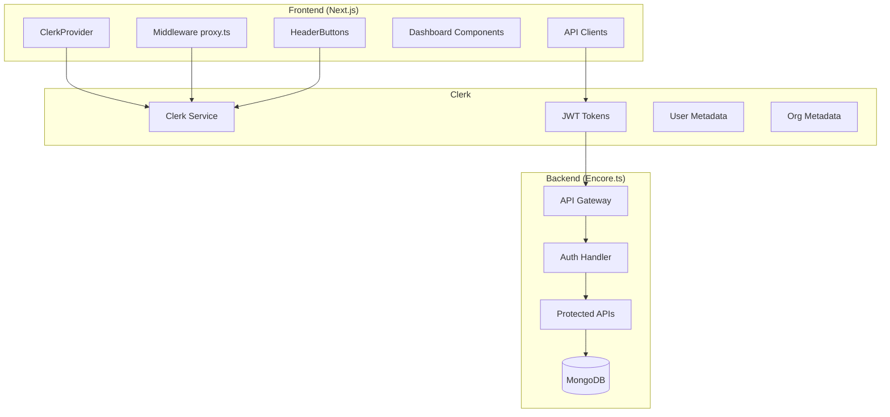
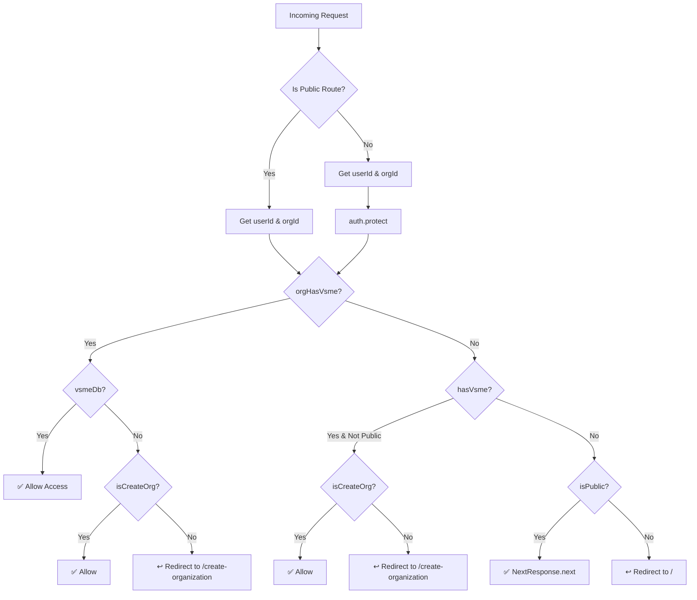
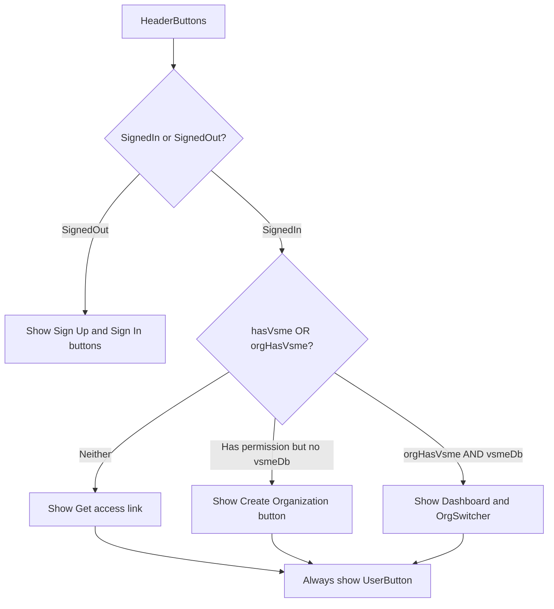
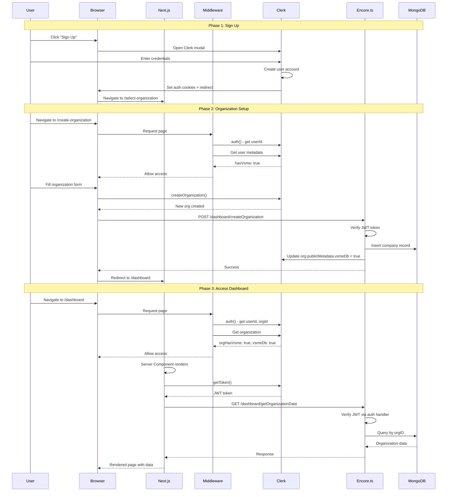
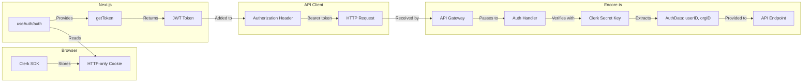

# Authentication Flow Documentation

This document provides a detailed explanation of the authentication flow in this Encore.ts + Next.js application using Clerk for identity management.

## Table of Contents
1. [Architecture Overview](#architecture-overview)
2. [Frontend Authentication Flow](#1-frontend-authentication-flow)
3. [Middleware Routing Logic](#2-middleware-routing-logic)
4. [Backend Authentication](#3-backend-authentication)
5. [Header Component Conditional Rendering](#4-header-component-conditional-rendering)
6. [End-to-End Flow](#5-end-to-end-flow)

---

## Architecture Overview



---

## 1. Frontend Authentication Flow

### 1.1 ClerkProvider Setup

The application wraps the entire app with `ClerkProvider` in the root layout, making Clerk's authentication context available throughout:

```typescript
// frontend/app/layout.tsx
export default function RootLayout({ children }) {
  return (
    <html lang="en">
      <body>
        <ClerkProvider appearance={{ baseTheme: shadcn }}>
          <ThemeProvider>
            <QueryClientProvider>
              {children}
            </QueryClientProvider>
          </ThemeProvider>
        </ClerkProvider>
      </body>
    </html>
  )
}
```

### 1.2 Sign-In/Sign-Up Process

**Sign-Up Flow:**
```typescript
// frontend/app/(auth)/sign-up/[[...sign-up]]/page.tsx
export default function SignUpPage() {
  return (
    <div className="min-h-screen flex items-center justify-center">
      <SignUp fallbackRedirectUrl="/select-organization" />
    </div>
  )
}
```

**Sign-In Flow:**
```typescript
// frontend/app/(auth)/sign-in/[[...sign-in]]/page.tsx
export default function SignInPage() {
  return (
    <div className="min-h-screen flex items-center justify-center">
      <SignIn fallbackRedirectUrl="/dashboard" />
    </div>
  )
}
```

### 1.3 JWT Token Management

Clerk handles JWT token storage automatically via secure HTTP-only cookies. The tokens are accessed via hooks:

**Client-Side Token Access:**
```typescript
// frontend/lib/api/client-side.ts
export function useApiClient() {
  const { getToken } = useAuth();

  return new Client(environment, {
    auth: async () => {
      const token = await getToken();
      return {
        authorization: `Bearer ${token}`,
      };
    },
  });
}
```

**Server-Side Token Access:**
```typescript
// frontend/lib/api/server-side.ts
export async function getApiClient() {
  const { getToken } = await auth();

  return new Client(environment, {
    auth: async () => {
      const token = await getToken();
      return {
        authorization: `Bearer ${token}`,
      };
    },
  });
}
```

### 1.4 Client-Side Auth State

Components use Clerk hooks to access authentication state:

```typescript
import { useUser, useOrganization, useAuth } from '@clerk/nextjs'

// Access current user
const { user, isLoaded, isSignedIn } = useUser()

// Access current organization
const { organization } = useOrganization()

// Access auth utilities
const { getToken, userId, orgId } = useAuth()
```

---

## 2. Middleware Routing Logic

The middleware (`frontend/proxy.ts`) intercepts all requests and enforces authentication/authorization rules.

### 2.1 Public Routes Definition

```typescript
const isPublicRoute = createRouteMatcher([
  "/",
  "/home",
  "/company(.*)",
  "/pricing",
  "/sign-in(.*)",
  "/sign-up(.*)"
]);
```

### 2.2 Metadata Flags

The middleware checks three critical flags from Clerk metadata:

| Flag | Location | Meaning |
|------|----------|---------|
| `hasVsme` | User publicMetadata | User has permission to create VSME organizations |
| `orgHasVsme` | Organization publicMetadata | Organization has VSME access |
| `vsmeDb` | Organization publicMetadata | Organization exists in MongoDB database |

### 2.3 Routing Decision Tree



### 2.4 Middleware Code Breakdown

```typescript
// frontend/proxy.ts
export default clerkMiddleware(async (auth, request) => {
  const isPublic = isPublicRoute(request);

  // 1️⃣ Get user and organization identifiers
  const { userId, orgId } = await auth();
  const client = await clerkClient();

  // Fetch organization metadata
  let organization = null;
  if (orgId) {
    organization = await client.organizations.getOrganization({
      organizationId: orgId as string
    });
  }

  // Extract permission flags
  const orgHasVsme = Boolean(organization?.publicMetadata?.hasVsme);
  const vsmeDb = Boolean(organization?.publicMetadata?.vsmeDb);
  const user = userId ? await client.users.getUser(userId) : null;
  const hasVsme = Boolean(user?.publicMetadata?.hasVsme);

  // 2️⃣ Protect non-public routes
  if (!isPublic) {
    await auth.protect(); // Redirects to sign-in if not authenticated
  }

  // 3️⃣ Routing logic based on permissions
  // Case A: Org has VSME access
  if (orgHasVsme) {
    if (!vsmeDb && !isPublic && !isCreateOrg) {
      return NextResponse.redirect(new URL("/create-organization", request.url));
    }
    return; // Allow access
  }

  // Case B: User can create org but doesn't have one
  if (hasVsme && !isPublic) {
    if (!isCreateOrg) {
      return NextResponse.redirect(new URL("/create-organization", request.url));
    }
    return;
  }

  // Case C: Visitor - allow public routes only
  if (isPublic) {
    return NextResponse.next();
  }

  // Fallback: redirect to home
  return NextResponse.redirect(new URL("/", request.url));
});
```

---

## 3. Backend Authentication

### 3.1 Auth Handler Architecture

The Encore.ts backend uses a custom auth handler that verifies Clerk JWT tokens:

```typescript
// encore-backend/auth/auth_handler.ts
import { verifyToken } from "@clerk/backend";
import { APIError, Gateway, type Header } from "encore.dev/api";
import { authHandler } from "encore.dev/auth";
import { secret } from "encore.dev/config";

const clerkSecretKey = secret("ClerkSecretKey");

// Define what auth data is passed to API endpoints
export interface AuthData {
  userID: string;  // Clerk user ID
  orgID: string;   // Clerk organization ID
}

// Interface for Clerk JWT token structure
interface VerifiedToken {
  sub: string;      // Subject (user ID)
  o?: {
    id?: string;    // Organization ID
    rol?: string;   // Role
    slg?: string;   // Slug
  };
  // ... other JWT claims
}
```

### 3.2 Token Verification Process

```typescript
export const auth = authHandler<AuthParams, AuthData>(async (params) => {
  try {
    // 1. Extract Bearer token
    const token = params.authorization.replace("Bearer ", "");

    // 2. Verify with Clerk's SDK
    const verifiedToken: VerifiedToken = await verifyToken(token, {
      secretKey: clerkSecretKey(),
    });

    // 3. Extract organization ID
    const orgId = verifiedToken.o?.id || verifiedToken["org_id"];

    // 4. Handle missing organization gracefully
    if (!orgId || orgId === "") {
      return {
        userID: verifiedToken.sub,
        orgID: "", // Let endpoints handle missing org
      };
    }

    // 5. Return auth data for use in API endpoints
    return {
      userID: verifiedToken.sub,
      orgID: orgId,
    };
  } catch (error) {
    throw APIError.unauthenticated("could not verify token");
  }
});

// Register the gateway with auth handler
export const gateway = new Gateway({
  authHandler: auth,
});
```

### 3.3 Using Auth Data in API Endpoints

Protected endpoints access auth data via `getAuthData()`:

```typescript
// encore-backend/dashboard/dashboard.ts
import { getAuthData } from "~encore/auth";
import { AuthData } from "../auth/auth_handler";

export const getOrganizationData = api(
  { method: "GET", expose: true, auth: true },
  async (): Promise<organizationData> => {
    // Get authenticated user/org info
    const authData = getAuthData();

    if (!authData) {
      throw APIError.unauthenticated("User not authenticated");
    }

    const { orgID } = authData as AuthData;

    if (!orgID) {
      throw APIError.invalidArgument("Organization ID not found");
    }

    // Use orgID to fetch organization-specific data
    const db = await getVsmeDatabase();
    const result = await db.collection("companies").findOne({
      organizationId: orgID
    });

    return result;
  }
);
```

---

## 4. Header Component Conditional Rendering

### 4.1 Auth State Detection

The `HeaderButtons` component uses Clerk hooks to detect auth state:

```typescript
// frontend/app/(landing)/HeaderButtons.tsx
'use client'

import {
  SignInButton, SignUpButton, SignedIn, SignedOut,
  UserButton, OrganizationSwitcher,
  useOrganization, useUser
} from '@clerk/nextjs'

export function HeaderButtons() {
  const { user } = useUser()
  const { organization } = useOrganization()

  // Permission flags
  const hasVsme = Boolean(user?.publicMetadata?.hasVsme)
  const orgHasVsme = Boolean(organization?.publicMetadata?.hasVsme)
  const vsmeDb = Boolean(organization?.publicMetadata?.vsmeDb)
```

### 4.2 Conditional Rendering Logic



### 4.3 Button States Implementation

```typescript
return (
  <>
    {/* Unauthenticated users */}
    <SignedOut>
      <div className="flex items-center gap-2">
        <SignUpButton fallbackRedirectUrl="/" mode="modal">
          <Button variant="outline">Sign up</Button>
        </SignUpButton>
        <SignInButton fallbackRedirectUrl="/" mode="modal">
          <Button>Sign in <ArrowRight /></Button>
        </SignInButton>
      </div>
    </SignedOut>

    {/* Authenticated users */}
    <SignedIn>
      <div className="flex items-center gap-4">
        {/* No VSME access - show "Get access" */}
        {(!hasVsme || !orgHasVsme) && (
          <Link href="/#contact">
            <GradientText>Get access</GradientText>
          </Link>
        )}

        {/* Has permission but needs to create org */}
        {(hasVsme || (orgHasVsme && !vsmeDb)) && (
          <Link href="/create-organization">
            <GradientText>Create Organization</GradientText>
          </Link>
        )}

        {/* Full access - show dashboard link + org switcher */}
        {orgHasVsme && vsmeDb && (
          <>
            <Button asChild variant="outline">
              <Link href="/dashboard">Dashboard <ArrowRight /></Link>
            </Button>
            <OrganizationSwitcher hidePersonal skipInvitationScreen />
          </>
        )}

        {/* Always show user menu */}
        <UserButton />
      </div>
    </SignedIn>
  </>
)
```

---

## 5. End-to-End Flow

### 5.1 Complete User Journey Diagram



### 5.2 Token Flow Detail



### 5.3 State Transitions

| State | hasVsme | orgHasVsme | vsmeDb | Allowed Routes | Redirect To |
|-------|---------|------------|--------|----------------|-------------|
| Visitor | ❌ | ❌ | ❌ | Public only | `/` |
| New User | ✅ | ❌ | ❌ | Public + `/create-organization` | `/create-organization` |
| Org Created | ✅ | ✅ | ❌ | Public + `/create-organization` | `/create-organization` |
| Full Access | ✅ | ✅ | ✅ | All routes | - |

---

## Summary

The authentication system uses a three-layer approach:

1. **Clerk (Identity)**: Handles user registration, login, JWT issuance, and organization management
2. **Next.js Middleware (Access Control)**: Enforces routing rules based on user/org metadata
3. **Encore.ts Auth Handler (API Security)**: Verifies JWTs and extracts auth context for API endpoints

This architecture provides:
- **Zero-trust security**: Every request is authenticated at multiple layers
- **Flexible permissions**: Metadata-based access control without code changes
- **Organization isolation**: Multi-tenant support with org-scoped data access
- **Seamless UX**: Automatic redirects guide users through onboarding

