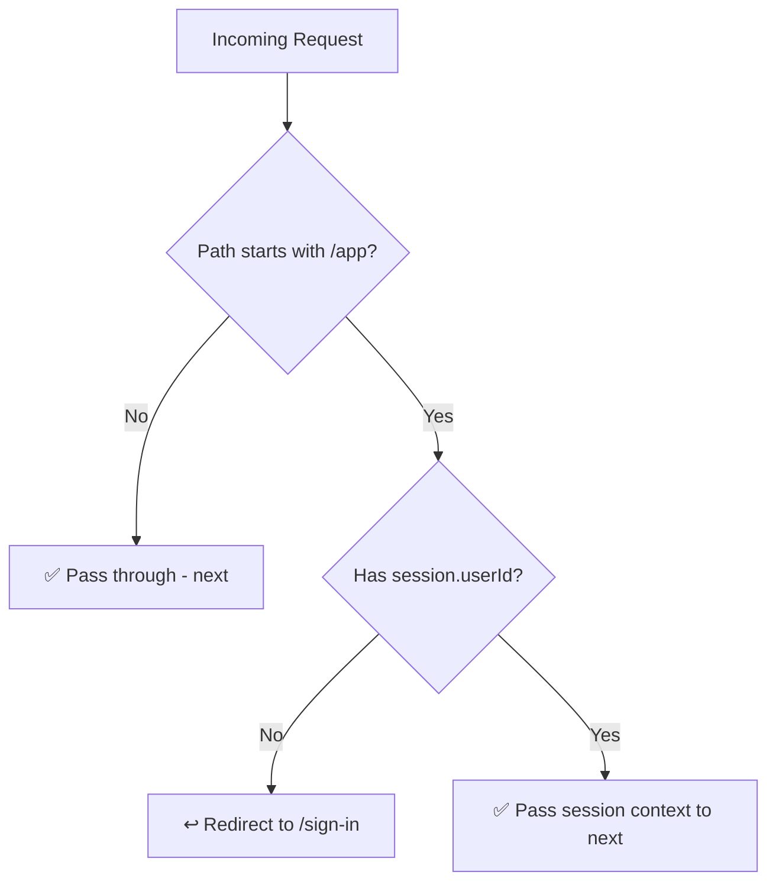
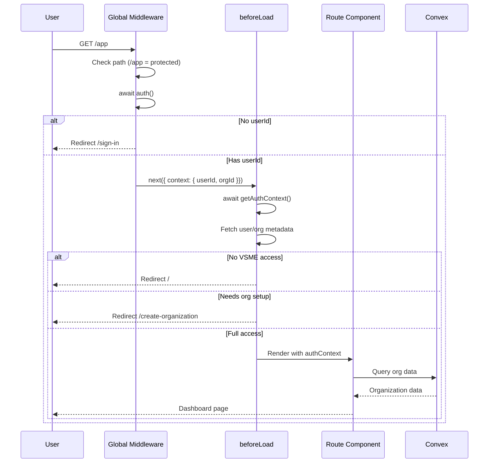

# Authentication Implementation Plan

## Overview

This document outlines the implementation plan for authentication and routing logic in the TC-VSME TanStack Start application, adapting the three-layer authentication approach from the reference Next.js implementation.

### Current Stack
- **Frontend Framework**: TanStack Start (React)
- **Authentication Provider**: Clerk (`@clerk/tanstack-react-start`)
- **Database**: Convex
- **Testing**: Vitest + Testing Library

### Reference Implementation
- Next.js + Clerk + Encore.ts + MongoDB

### Three-Layer Authentication Architecture

```
┌─────────────────────────────────────────────────────────────────┐
│                     Layer 1: Clerk (Identity)                   │
│  • User registration & login                                    │
│  • JWT token issuance                                          │
│  • Organization management                                      │
│  • User/Org publicMetadata storage                             │
└─────────────────────────────────────────────────────────────────┘
                              │
                              ▼
┌─────────────────────────────────────────────────────────────────┐
│     Layer 2: TanStack Start Global Middleware (Access Control)  │
│  • Global request middleware in src/start.ts                   │
│  • Fast auth checks using Clerk session (no DB calls)          │
│  • Route-based protection (/app/* requires auth)               │
│  • Automatic redirects for user journey                        │
│  • Context passing to downstream handlers                      │
└─────────────────────────────────────────────────────────────────┘
                              │
                              ▼
┌─────────────────────────────────────────────────────────────────┐
│              Layer 3: Convex (Data Layer Security)              │
│  • JWT token verification                                       │
│  • Organization-scoped data access                             │
│  • Multi-tenant isolation                                      │
└─────────────────────────────────────────────────────────────────┘
```

### Middleware Architecture

The auth middleware integrates with the existing Clerk middleware in `src/start.ts`:

```
Request → clerkMiddleware() → authMiddleware → Route Handler
              │                    │
              ▼                    ▼
         Parses JWT           Checks route
         Sets session         Redirects if needed
                              Passes context
```

**Key Principle**: The global middleware runs on ALL requests, so it must be fast.
- ✅ Check `request.url` path
- ✅ Use Clerk's `auth()` session data (already parsed by clerkMiddleware)
- ❌ NO database calls in middleware
- ❌ NO Clerk API calls to fetch metadata (too slow for every request)

---

## Permission Flags System

### Metadata Flags

| Flag | Location | Meaning |
|------|----------|---------|
| `hasVsme` | User `publicMetadata` | User has permission to create VSME organizations |
| `orgHasVsme` | Organization `publicMetadata` | Organization has VSME access |
| `vsmeDb` | Organization `publicMetadata` | Organization record exists in Convex database |

### User State Matrix

| State | hasVsme | orgHasVsme | vsmeDb | Allowed Routes | Redirect Target |
|-------|---------|------------|--------|----------------|-----------------|
| Visitor | ❌ | ❌ | ❌ | Public only | `/` |
| New User | ✅ | ❌ | ❌ | Public + `/create-organization` | `/create-organization` |
| Org Created | ✅ | ✅ | ❌ | Public + `/create-organization` | `/create-organization` |
| Full Access | ✅ | ✅ | ✅ | All routes | - |

---

## Epic: Authentication & Authorization System

### Epic Summary
Implement a complete authentication and authorization system that:
1. Protects routes based on user/organization metadata
2. Guides users through the onboarding journey
3. Ensures organization-level data isolation
4. Provides seamless UX with automatic redirects

### Success Criteria
- [ ] All protected routes require authentication
- [ ] Routing decisions correctly follow the metadata flags
- [ ] Users are guided through sign-up → org setup → dashboard flow
- [ ] Organization data is isolated per tenant
- [ ] All auth flows have automated test coverage

---

## User Stories

### Story 1: Global Auth Middleware
**Priority**: P0 (Critical Path)
**Estimate**: 1 day

#### Description
As a developer, I need a global request middleware that runs on all requests to check authentication status and redirect unauthenticated users from protected routes, without making slow database or API calls.

#### Technical Approach
Create a `createMiddleware({ type: 'request' })` that:
- Checks if the request URL path starts with `/app` (protected route)
- For non-protected routes, immediately calls `next()` (fast path)
- For protected routes, uses Clerk's `auth()` to get session
- Redirects to `/sign-in` if no session exists
- Passes session context to downstream handlers via `next({ context: { session } })`

**Key Constraint**: No database calls or Clerk API calls in middleware - only use session data already parsed by clerkMiddleware.

#### Files to Create/Modify
- `src/lib/auth/middleware.ts` - Auth middleware function
- `src/start.ts` - Add authMiddleware to requestMiddleware array

#### Implementation Pattern

```typescript
// src/lib/auth/middleware.ts
import { createMiddleware } from '@tanstack/react-start'
import { auth } from '@clerk/tanstack-react-start/server'
import { redirect } from '@tanstack/react-router'

// Protected route prefixes
const PROTECTED_PREFIXES = ['/app']

export const authMiddleware = createMiddleware({ type: 'request' }).server(
  async ({ next, request }) => {
    const url = new URL(request.url)

    // Fast path: non-protected routes
    const isProtected = PROTECTED_PREFIXES.some(prefix =>
      url.pathname.startsWith(prefix)
    )

    if (!isProtected) {
      return next()
    }

    // Protected route: check session
    const session = await auth()

    if (!session.userId) {
      throw redirect({ to: '/sign-in' })
    }

    // Pass session to downstream handlers
    return next({ context: { session } })
  }
)
```

```typescript
// src/start.ts
import { clerkMiddleware } from '@clerk/tanstack-react-start/server'
import { createStart } from '@tanstack/react-start'
import { authMiddleware } from './lib/auth/middleware'

export const startInstance = createStart(() => {
  return {
    requestMiddleware: [clerkMiddleware(), authMiddleware],
  }
})
```

#### Acceptance Criteria
- [ ] Middleware runs on all requests
- [ ] Non-protected routes pass through immediately (< 1ms overhead)
- [ ] Protected routes check session via Clerk's `auth()`
- [ ] Unauthenticated users on protected routes redirect to `/sign-in`
- [ ] Session context is available to downstream handlers
- [ ] No database or Clerk API calls in middleware

#### Test Cases
```typescript
// src/lib/auth/__tests__/middleware.test.ts
describe('authMiddleware', () => {
  it('passes through for public routes without auth check')
  it('passes through for / (home)')
  it('passes through for /sign-in')
  it('checks auth for /app routes')
  it('redirects to /sign-in when not authenticated')
  it('passes session context when authenticated')
})
```

---

### Story 2: Enhanced _appLayout Route Protection
**Priority**: P0 (Critical Path)
**Estimate**: 1 day

#### Description
As a user, I want the `/app` routes to check my VSME permissions and redirect me appropriately if I don't have the required access level.

#### Technical Approach
Enhance the existing `_appLayout` route to:
- Use `beforeLoad` to fetch full auth context (can make Clerk API calls here)
- Check `hasVsme`, `orgHasVsme`, and `vsmeDb` flags
- Redirect to `/create-organization` if user needs to set up org
- Pass auth context to child routes

**Note**: Unlike global middleware, `beforeLoad` only runs for routes under `_appLayout`, so API calls are acceptable here.

#### Routing Decision Tree (for /app routes)

```
┌─────────────────────────┐
│   /app/* Request        │
│   (already authed by    │
│    global middleware)   │
└───────────┬─────────────┘
            ▼
┌─────────────────────────┐
│  Fetch user/org metadata│
│  (Clerk API call OK)    │
└───────────┬─────────────┘
            ▼
     ┌────────────────────┐
     │   orgHasVsme?      │
     └────────┬───────────┘
        ┌─────┴─────┐
       Yes          No
        │            │
        ▼            ▼
   ┌─────────┐  ┌─────────────┐
   │ vsmeDb? │  │  hasVsme?   │
   └────┬────┘  └──────┬──────┘
    Yes│No         Yes │ No
       │  │            │   │
       ▼  ▼            ▼   ▼
   ┌────┐ ┌────────┐ ┌────────┐ ┌────┐
   │ ✅ │ │Redirect│ │Redirect│ │ /  │
   │Pass│ │/create │ │/create │ │Home│
   └────┘ │ -org   │ │  -org  │ └────┘
          └────────┘ └────────┘
```

#### Files to Modify
- `src/routes/_appLayout/route.tsx` - Enhanced beforeLoad with metadata checks
- `src/lib/auth/get-auth-context.ts` - Server function for fetching full auth context

#### Implementation Pattern

```typescript
// src/lib/auth/get-auth-context.ts
import { auth, clerkClient } from '@clerk/tanstack-react-start/server'
import { createServerFn } from '@tanstack/react-start'
import type { AuthContext } from './types'

export const getAuthContext = createServerFn({ method: 'GET' })
  .handler(async (): Promise<AuthContext | null> => {
    const { userId, orgId } = await auth()

    if (!userId) {
      return null
    }

    const client = await clerkClient()

    // Fetch user metadata (OK to call Clerk API in beforeLoad)
    const user = await client.users.getUser(userId)
    const hasVsme = Boolean(user.publicMetadata?.hasVsme)

    // Fetch org metadata if org selected
    let orgHasVsme = false
    let vsmeDb = false

    if (orgId) {
      const org = await client.organizations.getOrganization({
        organizationId: orgId
      })
      orgHasVsme = Boolean(org.publicMetadata?.hasVsme)
      vsmeDb = Boolean(org.publicMetadata?.vsmeDb)
    }

    return {
      isAuthenticated: true,
      userId,
      orgId: orgId || null,
      hasVsme,
      orgHasVsme,
      vsmeDb,
      canAccessDashboard: orgHasVsme && vsmeDb,
      needsOrgSetup: hasVsme && (!orgId || !vsmeDb),
    }
  })
```

```typescript
// src/routes/_appLayout/route.tsx (enhanced beforeLoad)
export const Route = createFileRoute('/_appLayout')({
  component: RouteComponent,
  beforeLoad: async () => {
    const authContext = await getAuthContext()

    // Already authenticated by global middleware, but check VSME access
    if (!authContext?.hasVsme && !authContext?.orgHasVsme) {
      throw redirect({ to: '/' })
    }

    if (authContext.needsOrgSetup) {
      throw redirect({ to: '/create-organization' })
    }

    return { authContext }
  },
})
```

#### Acceptance Criteria
- [ ] `/app` routes fetch full auth context with metadata
- [ ] Users without `hasVsme` or `orgHasVsme` are redirected to home
- [ ] Users with `hasVsme` but no org are redirected to `/create-organization`
- [ ] Users with `orgHasVsme` but no `vsmeDb` are redirected to `/create-organization`
- [ ] Users with full access (`orgHasVsme` + `vsmeDb`) can access dashboard
- [ ] Auth context is available to child routes via `Route.useRouteContext()`

#### Test Cases
```typescript
// src/lib/auth/__tests__/get-auth-context.test.ts
describe('getAuthContext', () => {
  it('returns null when user is not authenticated')
  it('returns hasVsme flag from user publicMetadata')
  it('returns orgHasVsme and vsmeDb flags from org publicMetadata')
  it('computes canAccessDashboard correctly')
  it('computes needsOrgSetup correctly')
  it('handles missing organization gracefully')
})
```

---

### Story 3: Create Organization Page
**Priority**: P1 (High)
**Estimate**: 1 day
**Dependencies**: Story 5 (Convex Schema) must be completed first

#### Description
As a user with VSME permission, I want to create or select an organization, so that I can set up my workspace and access the dashboard.

#### Technical Approach
Create a page that:
- Renders Clerk's `OrganizationSwitcher` component
- Allows creating new organizations
- Is accessible to users with `hasVsme` but not yet `vsmeDb`
- Calls Convex mutation to create org/user records on org creation (uses Story 5 mutations)

**Note**: The `/create-organization` page must NOT be under `_appLayout` since users are redirected here when they don't have full access yet.

#### Files to Create/Modify
- `src/routes/create-organization.tsx` - Organization setup page (root level, not under _appLayout)

#### Acceptance Criteria
- [ ] Page renders OrganizationSwitcher from Clerk
- [ ] Page is accessible to authenticated users with `hasVsme`
- [ ] Users without `hasVsme` are redirected to home

#### Test Cases
```typescript
describe('CreateOrganization page', () => {
  it('redirects users without hasVsme to home')
  it('renders OrganizationSwitcher for eligible users')
})
```

**Note**: Tests for Convex record creation, metadata updates, and redirect to `/app` are in Story 5.

---

### Story 5: Convex Schema & Organization/User Mutations
**Priority**: P1 (High)
**Estimate**: 1.5 days

#### Description
As a developer, I need Convex tables and mutations to store organization and user data, manage the `vsmeDb` flag, and enable organization-scoped data isolation with user tracking for future analytics.

#### Technical Approach
Extend Convex schema with organizations and users tables:

```typescript
// convex/schema.ts
organizations: defineTable({
  clerkOrgId: v.string(),
  name: v.string(),
  _createdAt: v.number(), // Created automatically by Convex
  // ... additional org fields
}).index('by_clerk_org_id', ['clerkOrgId'])

users: defineTable({
  clerkId: v.string(),
  email: v.string(),
  firstName: v.optional(v.string()),
  lastName: v.optional(v.string()),
  username: v.optional(v.string()),
  organizationIds: v.array(v.string()), // Array of Clerk org IDs
  _createdAt: v.number(), // Created automatically by Convex
  updatedAt: v.number(),
}).index('by_clerk_id', ['clerkId'])
  .index('by_email', ['email'])
```

When a user creates/joins an organization:
1. Upsert user record (create if not exists, update organizationIds if exists)
2. Create organization record if not exists
3. Update Clerk org metadata with `vsmeDb: true`
4. Update Clerk user metadata with `hasVsme: false` (since they now have full access and can't create more orgs))`

#### Files to Create/Modify
- `convex/schema.ts` - Add organizations and users tables
- `convex/organizations.ts` - Org CRUD mutations
- `convex/users.ts` - User upsert mutations
- `convex/auth.ts` - Auth helper functions (optional)

#### Acceptance Criteria
- [ ] Organizations table exists with proper schema
- [ ] Users table exists with proper schema
- [ ] `createOrganization` mutation creates org record and upserts user record
- [ ] `upsertUser` mutation creates or updates user with organizationIds
- [ ] User record includes clerkId, email, firstName, lastName, username, organizationIds
- [ ] `getOrganization` query fetches org by Clerk ID
- [ ] `getUserByClerkId` query fetches user by Clerk ID
- [ ] Indexes on `clerkOrgId` and `clerkId` for efficient lookups
- [ ] Proper error handling for duplicate orgs
- [ ] Org metadata updated with `vsmeDb: true` after successful creation
- [ ] User redirected to `/app` after successful org creation

#### Test Cases
```typescript
// Convex function tests - organizations
describe('organizations mutations', () => {
  it('creates organization with clerkOrgId')
  it('prevents duplicate clerkOrgId entries')
  it('fetches organization by clerkOrgId')
  it('returns null for non-existent org')
  it('updates org metadata with vsmeDb flag')
  it('redirects to /app after successful setup')
})

// Convex function tests - users
describe('users mutations', () => {
  it('creates user with clerkId, email, and name fields')
  it('upserts user when already exists')
  it('adds organizationId to existing user organizationIds array')
  it('fetches user by clerkId')
  it('returns null for non-existent user')
  it('stores username when available from Clerk')
})
```

---

### Story 6: Header Conditional Rendering
**Priority**: P2 (Medium)
**Estimate**: 1 day

#### Description
As a user, I want the header to show different buttons based on my authentication state and permissions, so that I can navigate to relevant actions.

#### Technical Approach
Create conditional rendering logic in header component:

| State | Buttons Shown |
|-------|---------------|
| Signed Out | Sign Up, Sign In |
| Signed In, no VSME | Get Access link, UserButton |
| Has VSME, no org/db | Create Organization, UserButton |
| Full Access | Dashboard, OrgSwitcher, UserButton |

#### Files to Modify
- `src/components/Header.tsx` - Add conditional auth buttons
- `src/integrations/clerk/header-user.tsx` - Enhance with org logic

#### Acceptance Criteria
- [ ] Signed-out users see Sign Up and Sign In buttons
- [ ] Signed-in users always see UserButton
- [ ] Users without VSME see "Get access" link
- [ ] Users with VSME permission see "Create Organization" when no db record
- [ ] Users with full access see Dashboard button and OrganizationSwitcher

#### Test Cases
```typescript
describe('HeaderButtons', () => {
  it('renders SignUp and SignIn for signed-out users')
  it('renders UserButton for all signed-in users')
  it('renders "Get access" when hasVsme is false')
  it('renders "Create Organization" when hasVsme but no vsmeDb')
  it('renders Dashboard and OrgSwitcher when full access')
})
```

---

### Story 7: Convex + Clerk JWT Integration
**Priority**: P1 (High)
**Estimate**: 1.5 days

#### Description
As a developer, I need Convex to verify Clerk JWT tokens and extract user/org context, ensuring secure API access.

#### Technical Approach
Configure Convex to use Clerk as auth provider:
1. Set up Clerk JWT template for Convex
2. Configure Convex auth handler
3. Create helper to get auth context in Convex functions

#### Files to Create/Modify
- `convex/auth.config.ts` - Clerk auth configuration
- `convex/_utils/auth.ts` - Auth helper utilities

#### Acceptance Criteria
- [ ] Convex functions can access authenticated user ID
- [ ] Convex functions can access organization ID from JWT
- [ ] Unauthenticated requests are properly rejected
- [ ] Auth context is type-safe

#### Test Cases
```typescript
describe('Convex Auth', () => {
  it('extracts userId from Clerk JWT')
  it('extracts orgId from Clerk JWT')
  it('rejects requests without valid JWT')
  it('handles missing orgId gracefully')
})
```

---

### Story 8: Dashboard with Organization Data
**Priority**: P1 (High)
**Estimate**: 1 day

#### Description
As a user with full access, I want the dashboard pages to display organization-specific data fetched from Convex, with proper loading and error states.

#### Technical Approach
Enhance dashboard pages to:
- Use auth context from `Route.useRouteContext()`
- Query Convex with organization ID filter
- Display org-specific data

**Note**: Auth protection is already handled by global middleware (Story 1) and `_appLayout` beforeLoad (Story 2).

#### Files to Modify
- `src/routes/_appLayout/app/index.tsx` - Dashboard with org data

#### Implementation Pattern
```typescript
// src/routes/_appLayout/app/index.tsx
function RouteComponent() {
  const { authContext } = Route.useRouteContext()
  const { orgId } = authContext

  // Query Convex with org filter
  const orgData = useQuery(api.organizations.getByClerkId, {
    clerkOrgId: orgId
  })

  if (!orgData) return <LoadingSpinner />

  return <Dashboard data={orgData} />
}
```

#### Acceptance Criteria
- [ ] Dashboard accesses auth context from route context
- [ ] Convex queries are scoped to current organization
- [ ] Loading states are shown while fetching data
- [ ] Error states are handled gracefully
- [ ] Organization switcher updates the data displayed

---

### Story 9: End-to-End Auth Flow Tests
**Priority**: P1 (High)
**Estimate**: 2 days

#### Description
As a developer, I need end-to-end tests covering the complete authentication journey, ensuring the system works correctly in production-like conditions.

#### Technical Approach
Create E2E tests using Playwright or similar:
1. Sign-up flow → create org → dashboard access
2. Sign-in flow → existing org → dashboard access
3. Permission denial scenarios
4. Organization switching

#### Test Scenarios
```typescript
describe('E2E Authentication Flow', () => {
  describe('New User Journey', () => {
    it('signs up and redirects to organization setup')
    it('creates organization and redirects to dashboard')
    it('can access org-specific data')
  })

  describe('Returning User', () => {
    it('signs in and accesses dashboard directly')
    it('can switch between organizations')
  })

  describe('Permission Boundaries', () => {
    it('denies dashboard access without vsmeDb')
    it('denies protected routes for visitors')
  })
})
```

---

## Implementation Timeline

### Phase 1: Foundation (Week 1)
- Story 1: Global Auth Middleware (1 day)
- Story 2: Enhanced _appLayout Route Protection (1 day)
- Story 4: Convex + Clerk JWT Integration (1.5 days)
- Story 5: Convex Schema & Organization/User Mutations (1.5 days)

### Phase 2: Core Features (Week 2)
- Story 3: Create Organization Page (1 day) - *depends on Story 5*
- Story 6: Header Conditional Rendering (1 day)
- Story 8: Dashboard with Organization Data (1 day)
- Integration testing (1 day)

### Phase 3: Testing & Polish (Week 3)
- Story 9: End-to-End Auth Flow Tests (2 days)
- Bug fixes and edge cases (1-2 days)
- Documentation updates (0.5 days)

### Story Summary Table

| # | Story | Priority | Estimate | Dependencies |
|---|-------|----------|----------|--------------|
| 1 | Global Auth Middleware | P0 | 1 day | - |
| 2 | Enhanced _appLayout Route Protection | P0 | 1 day | Story 1 |
| 3 | Create Organization Page | P1 | 1 day | Story 1, 2, **5** |
| 4 | Convex + Clerk JWT Integration | P1 | 1.5 days | - |
| 5 | Convex Schema & Org/User Mutations | P1 | 1.5 days | Story 4 |
| 6 | Header Conditional Rendering | P2 | 1 day | - |
| 7 | *(Merged into Story 4)* | - | - | - |
| 8 | Dashboard with Organization Data | P1 | 1 day | Story 2, 5 |
| 9 | End-to-End Auth Flow Tests | P1 | 2 days | All |

**Note**: Story 3 depends on Story 5 because the Create Organization page needs to call the Convex mutations to create org/user records.

---

## Technical Implementation Details

### 1. Global Auth Middleware (Fast Path)

```typescript
// src/lib/auth/middleware.ts
import { createMiddleware } from '@tanstack/react-start'
import { auth } from '@clerk/tanstack-react-start/server'
import { redirect } from '@tanstack/react-router'

// Routes that require authentication
const PROTECTED_PREFIXES = ['/app']

export const authMiddleware = createMiddleware({ type: 'request' }).server(
  async ({ next, request }) => {
    const url = new URL(request.url)

    // Fast path: skip auth check for non-protected routes
    const isProtected = PROTECTED_PREFIXES.some(prefix =>
      url.pathname.startsWith(prefix)
    )

    if (!isProtected) {
      return next()
    }

    // Protected route: verify session (no API calls, just JWT check)
    const session = await auth()

    if (!session.userId) {
      throw redirect({ to: '/sign-in' })
    }

    // Pass basic session info to downstream handlers
    return next({
      context: {
        userId: session.userId,
        orgId: session.orgId
      }
    })
  }
)
```

```typescript
// src/start.ts
import { clerkMiddleware } from '@clerk/tanstack-react-start/server'
import { createStart } from '@tanstack/react-start'
import { authMiddleware } from './lib/auth/middleware'

export const startInstance = createStart(() => {
  return {
    // Middleware chain: clerkMiddleware parses JWT, authMiddleware checks routes
    requestMiddleware: [clerkMiddleware(), authMiddleware],
  }
})
```

### 2. Auth Context Type Definition

```typescript
// src/lib/auth/types.ts
export interface AuthContext {
  isAuthenticated: boolean
  userId: string
  orgId: string | null

  // Permission flags from Clerk metadata
  hasVsme: boolean
  orgHasVsme: boolean
  vsmeDb: boolean

  // Computed properties
  canAccessDashboard: boolean
  needsOrgSetup: boolean
}

export interface ClerkUserMetadata {
  hasVsme?: boolean
}

export interface ClerkOrgMetadata {
  hasVsme?: boolean
  vsmeDb?: boolean
}
```

### 3. Full Auth Context Server Function (for beforeLoad)

```typescript
// src/lib/auth/get-auth-context.ts
import { auth, clerkClient } from '@clerk/tanstack-react-start/server'
import { createServerFn } from '@tanstack/react-start'
import type { AuthContext } from './types'

export const getAuthContext = createServerFn({ method: 'GET' })
  .handler(async (): Promise<AuthContext | null> => {
    const { userId, orgId } = await auth()

    if (!userId) {
      return null
    }

    const client = await clerkClient()

    // Fetch user metadata (OK in beforeLoad, runs once per navigation)
    const user = await client.users.getUser(userId)
    const hasVsme = Boolean(user.publicMetadata?.hasVsme)

    // Fetch org metadata if org selected
    let orgHasVsme = false
    let vsmeDb = false

    if (orgId) {
      const org = await client.organizations.getOrganization({
        organizationId: orgId
      })
      orgHasVsme = Boolean(org.publicMetadata?.hasVsme)
      vsmeDb = Boolean(org.publicMetadata?.vsmeDb)
    }

    return {
      isAuthenticated: true,
      userId,
      orgId: orgId || null,
      hasVsme,
      orgHasVsme,
      vsmeDb,
      canAccessDashboard: orgHasVsme && vsmeDb,
      needsOrgSetup: hasVsme && (!orgId || !vsmeDb),
    }
  })
```

### 4. Enhanced _appLayout Route

```typescript
// src/routes/_appLayout/route.tsx
import { createFileRoute, redirect } from '@tanstack/react-router'
import { getAuthContext } from '@/lib/auth'

export const Route = createFileRoute('/_appLayout')({
  beforeLoad: async () => {
    // Global middleware already verified authentication
    // Now check VSME permissions (requires Clerk API calls)
    const authContext = await getAuthContext()

    if (!authContext) {
      // Should not happen (global middleware redirects), but handle gracefully
      throw redirect({ to: '/sign-in' })
    }

    // Check VSME access
    if (!authContext.hasVsme && !authContext.orgHasVsme) {
      throw redirect({ to: '/' })
    }

    // Check if org setup is needed
    if (authContext.needsOrgSetup) {
      throw redirect({ to: '/create-organization' })
    }

    // Pass auth context to child routes
    return { authContext }
  },
  component: RouteComponent,
})
```

---

## File Structure

```
src/
├── start.ts                           # Global middleware registration
├── lib/
│   └── auth/
│       ├── index.ts                   # Public exports
│       ├── types.ts                   # AuthContext type definitions
│       ├── middleware.ts              # Global auth middleware
│       ├── get-auth-context.ts        # Server function for full auth context
│       └── __tests__/
│           ├── middleware.test.ts
│           └── get-auth-context.test.ts
├── routes/
│   ├── __root.tsx                     # Root with ClerkProvider
│   ├── index.tsx                      # Public home page
│   ├── create-organization.tsx        # Org setup page (NOT under _appLayout)
│   ├── _appLayout/                    # Protected app layout (existing)
│   │   ├── route.tsx                  # Enhanced with VSME permission checks
│   │   └── app/
│   │       ├── index.tsx              # Dashboard with org data
│   │       └── ...                    # Other app routes
│   ├── sign-in/
│   │   └── [[...sign-in]].tsx         # Clerk sign-in
│   └── sign-up/
│       └── [[...sign-up]].tsx         # Clerk sign-up
├── components/
│   ├── Header.tsx                     # Updated with conditional auth buttons
│   └── HeaderButtons.tsx              # Auth-aware navigation component
└── integrations/
    └── clerk/
        ├── provider.tsx               # ClerkProvider wrapper
        └── header-user.tsx            # Enhanced with org logic

convex/
├── schema.ts                          # Updated with organizations and users tables
├── organizations.ts                   # Org CRUD operations
├── users.ts                           # User upsert operations
└── auth.config.ts                     # Clerk JWT integration
```

### Key Architecture Decisions

1. **No separate `_authed` layout**: The existing `_appLayout` serves as the protected layout
2. **Global middleware for basic auth**: Fast check in `src/start.ts` (no DB calls)
3. **Route-level checks for permissions**: `beforeLoad` in `_appLayout` for VSME metadata
4. **`/create-organization` at root level**: Accessible before user has full VSME access

---

## Testing Strategy

### Unit Tests (Vitest)
- Auth context functions
- Route guard logic
- Public route matching
- Metadata flag parsing

### Integration Tests
- Clerk middleware behavior
- Convex auth integration
- Route protection flow

### E2E Tests (Playwright)
- Complete user journeys
- Permission boundary testing
- Organization switching

### Test Coverage Goals
- Auth utilities: 90%+
- Route guards: 85%+
- Components: 75%+

---

## Dependencies & Prerequisites

### Required Environment Variables
```env
VITE_CLERK_PUBLISHABLE_KEY=pk_...
CLERK_SECRET_KEY=sk_...
VITE_CONVEX_URL=https://...
```

### Clerk Configuration
- Enable Organizations feature
- Configure JWT template for Convex
- Set up public metadata fields

### Convex Configuration
- Configure Clerk as auth provider
- Set JWT issuer URL

---

## Risk Mitigation

| Risk | Mitigation |
|------|------------|
| Clerk API rate limits | Implement caching for metadata |
| JWT token expiration | Handle refresh gracefully |
| Org switch mid-request | Invalidate cached auth context |
| Convex cold starts | Optimize function bundle size |

---

## Open Questions

1. **Webhook integration**: Should we use Clerk webhooks to sync metadata to Convex, or fetch on-demand?
2. **Caching strategy**: How long should auth context be cached?
3. **Error pages**: Should we create custom 401/403 error components?
4. **Audit logging**: Do we need to log authentication events?

---

## Appendix: Routing Decision Tree (Mermaid)

### Layer 1: Global Middleware (Fast Check)



### Layer 2: _appLayout beforeLoad (Permission Check)

```mermaid
flowchart TD
    A[/app/* Request] --> B[Fetch full auth context]
    B --> C{hasVsme OR orgHasVsme?}
    C -->|No| D[↩️ Redirect to /]
    C -->|Yes| E{needsOrgSetup?}
    E -->|Yes| F[↩️ Redirect to /create-organization]
    E -->|No| G{canAccessDashboard?}
    G -->|No| H[↩️ Redirect to /create-organization]
    G -->|Yes| I[✅ Allow - pass authContext]
```

### Complete Flow Diagram




