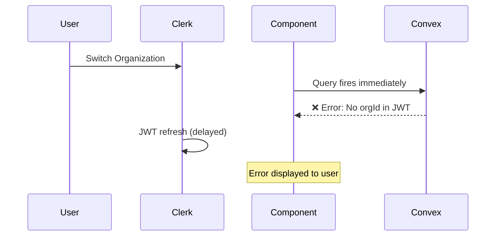
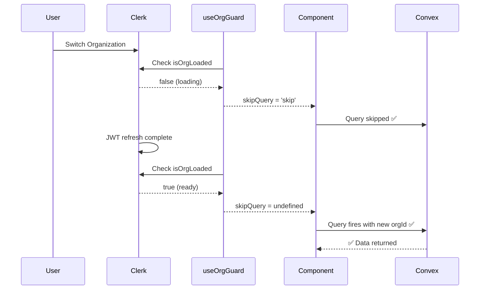

# Organization Loading Guard - Implementation Walkthrough

## Problem Solved

Fixed race condition where Convex queries would fire before Clerk's JWT was updated with the new `orgId` during organization switching, causing "Unauthorized: Organization must be selected" errors.

## Solution Overview

Created a centralized `useOrgGuard()` hook that ensures both Clerk's organization context and Convex authentication are ready before allowing queries to execute.

---

## Changes Made

### 1. Created Core Hook

#### [use-org-guard.ts](../../src/hooks/use-org-guard.ts)

```typescript
export function useOrgGuard() {
  const { organization, isLoaded: isOrgLoaded } = useOrganization()
  const { isAuthenticated, isLoading: isAuthLoading } = useConvexAuth()

  const isReady = isAuthenticated && isOrgLoaded && !!organization
  const isLoading = isAuthLoading || !isOrgLoaded

  return {
    isReady,      // true when safe to make queries
    isLoading,    // true during org switching
    organization,
    skipQuery: !isReady ? ('skip' as const) : undefined,
  }
}
```

**Key Features**:
- ✅ Waits for Clerk organization to load
- ✅ Waits for Convex authentication
- ✅ Provides `skipQuery` helper for consistent usage
- ✅ Returns loading states for UI feedback

---

### 2. Updated Query Patterns

#### [use-form-submission.ts](../../src/hooks/use-form-submission.ts)

**Before**:
```typescript
const existingData = useQuery(api.forms.get.getForm, {
  table,
  reportingYear,
  section,
})
```

**After**:
```typescript
const { skipQuery } = useOrgGuard()

const existingData = useQuery(
  api.forms.get.getForm,
  skipQuery || {
    table,
    reportingYear,
    section,
  }
)
```

---

#### [general/index.tsx](../../src/routes/_appLayout/app/general/index.tsx)

**Added**:
- Organization guard before query
- Loading state during org switching

```typescript
const { skipQuery, isLoading: isOrgLoading } = useOrgGuard()

const formSections = useQuery(
  api.forms.get.getFormAllSectionsWithContributors,
  skipQuery || {
    table: 'formGeneral',
    reportingYear,
  },
)

if (isOrgLoading) {
  return <div>Loading organization...</div>
}
```

---

#### [b1-general-form.tsx](../../src/components/forms/b1-general-form.tsx)

**Before**:
```typescript
const { organization } = useOrganization()
const orgData = useQuery(
  api.organizations.getByClerkOrgId,
  organization?.id ? { clerkOrgId: organization.id } : 'skip',
)
```

**After**:
```typescript
const { organization, skipQuery } = useOrgGuard()
const orgData = useQuery(
  api.organizations.getByClerkOrgId,
  skipQuery || { clerkOrgId: organization?.id ?? '' },
)
```

---

## How It Works

### The Race Condition Flow (Before Fix)



### The Protected Flow (After Fix)



---

## Verification Steps

### Manual Testing Required

> [!IMPORTANT]
> **Please test the following scenarios** to verify the fix works in your environment:

#### Test 1: Organization Switching
1. Navigate to `/app/general` with Organization A selected
2. Open browser DevTools → Console tab
3. Use the `OrganizationSwitcher` to switch to Organization B
4. **Expected**: 
   - Brief "Loading organization..." message appears
   - No "Unauthorized" errors in console
   - Page loads with Organization B's data

#### Test 2: Page Refresh
1. While on `/app/general`, refresh the page
2. **Expected**: Page loads without errors

#### Test 3: Rapid Switching
1. Switch between organizations multiple times quickly
2. **Expected**: No errors, smooth transitions

---

## Files Modified

- ✅ [use-org-guard.ts](../../src/hooks/use-org-guard.ts) - **NEW** hook
- ✅ [use-form-submission.ts](../../src/hooks/use-form-submission.ts) - Added guard
- ✅ [general/index.tsx](../../src/routes/_appLayout/app/general/index.tsx) - Added guard + loading UI
- ✅ [b1-general-form.tsx](../../src/components/forms/b1-general-form.tsx) - Replaced manual check with guard

---

## Technical Details

### Why This Works

1. **Clerk's `isOrgLoaded`**: Indicates when organization context is available
2. **Convex's `isAuthenticated`**: Indicates when JWT is ready
3. **Combined Guard**: Only allows queries when BOTH are ready
4. **`skipQuery` Pattern**: Convex's built-in way to prevent queries from firing

### Why NOT a Store?

A client-side store (like `yearStore`) wouldn't work because:
- The `orgId` comes from **JWT claims** (server-side), not client state
- You can't override or inject JWT claims from the client
- The backend reads `orgId` from `ctx.auth.getUserIdentity()`

The guard hook works because it **waits** for the JWT to be refreshed with the new `orgId` before allowing queries to proceed.

---

## Next Steps (Optional)

- [ ] Add unit tests for `useOrgGuard` hook
- [ ] Apply guard to other query locations for consistency:
  - `app/index.tsx`
  - `app/settings/index.tsx`
