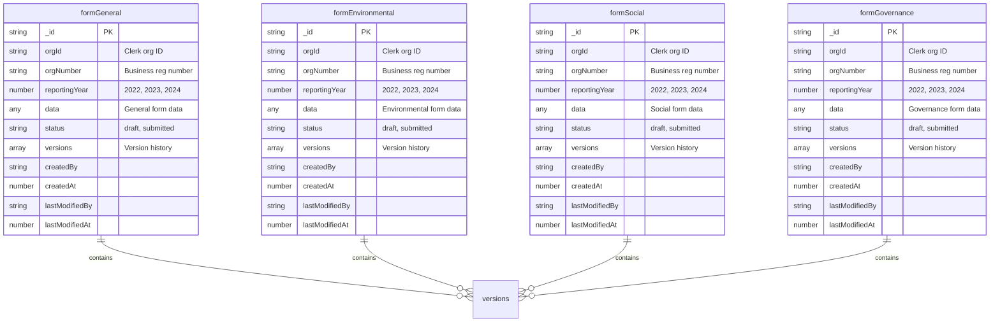
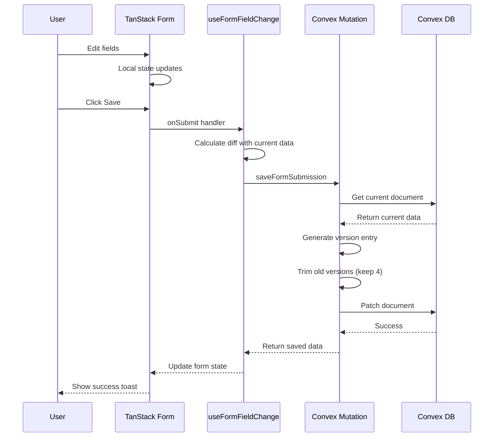
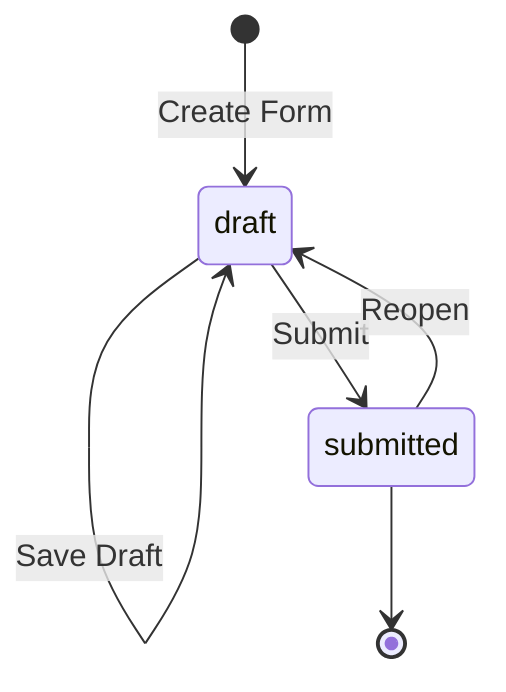

# Form Change Tracking Implementation Plan

## Overview

This plan outlines the implementation of a form change tracking system for the VSME reporting application. The system will track form changes, support version history with rollback capability, and handle concurrent editing.

## Requirements Summary

| Requirement         | Description                                       |
| ------------------- | ------------------------------------------------- |
| Change Tracking     | Track which fields changed, old and new values    |
| Save Behavior       | Track changes on explicit save (user clicks Save) |
| Multiple Forms      | Support multiple form types (B1, B2, C1, etc.)    |
| Version History     | Keep last 3-4 versions with rollback capability   |
| Concurrent Editing  | Multiple users can edit; Convex handles sync      |
| User Tracking       | Track which user made each change                 |
| Form Identification | orgNumber + reportingYear + formType              |

## Architecture Design

### Database Schema

We'll use separate tables for each form page to keep data manageable. Each table has the same structure but stores different types of form data.



### Version History Structure

Each version in the `versions` array contains:

```typescript
interface FormVersion {
  version: number              // Incremental version number
  data: B1GeneralFormValues    // Snapshot of form data
  changes: FieldChange[]       // What changed from previous version
  changedBy: string            // User ID who made the change
  changedAt: number            // Timestamp
}

interface FieldChange {
  field: string                // Field path (e.g., "revenue" or "subsidiaries[0].name")
  oldValue: unknown            // Previous value
  newValue: unknown            // New value
}
```

### Indexes

Each table has the same index structure:

```typescript
// Primary lookup: Get form by org and year
.index("by_org_year", ["orgId", "reportingYear"])

// Alternative lookup by org number
.index("by_orgNumber_year", ["orgNumber", "reportingYear"])

// List all forms for an org
.index("by_orgId", ["orgId"])
```

**Table Mapping:**

| Page          | Table Name          | Form Type |
| ------------- | ------------------- | --------- |
| General       | `formGeneral`       | B1        |
| Environmental | `formEnvironmental` | B2        |
| Social        | `formSocial`        | C1        |
| Governance    | `formGovernance`    | C2        |

## Data Flow



## Change Detection Algorithm

```typescript
function detectChanges(
  oldData: FormValues, 
  newData: FormValues
): FieldChange[] {
  const changes: FieldChange[] = []
  
  for (const key of Object.keys(newData)) {
    if (!isEqual(oldData[key], newData[key])) {
      changes.push({
        field: key,
        oldValue: oldData[key],
        newValue: newData[key]
      })
    }
  }
  
  return changes
}
```

For nested objects and arrays, we'll use deep comparison via `lodash.isEqual` or a custom implementation.

## API Design

### Generic Form Functions

We'll create generic functions that work with any form table. This avoids code duplication.

```typescript
// convex/forms/_utils.ts
type FormTable = "formGeneral" | "formEnvironmental" | "formSocial" | "formGovernance"

interface SaveFormArgs {
  table: FormTable
  reportingYear: number
  data: any
}

interface GetFormArgs {
  table: FormTable
  reportingYear: number
}
```

### Convex Mutations

#### saveForm
Generic mutation that saves to any form table.

```typescript
// convex/forms/save.ts
export const saveForm = mutation({
  args: {
    table: v.union(
      v.literal("formGeneral"),
      v.literal("formEnvironmental"),
      v.literal("formSocial"),
      v.literal("formGovernance")
    ),
    reportingYear: v.number(),
    data: v.any(),
  },
  handler: async (ctx, args) => {
    const userId = await requireUserId(ctx)
    const orgId = await requireOrgId(ctx)
    const org = await getOrgByClerkId(ctx, orgId)
    
    // Find existing submission
    const existing = await ctx.db
      .query(args.table)
      .withIndex("by_org_year", q =>
        q.eq("orgId", orgId)
         .eq("reportingYear", args.reportingYear)
      )
      .first()
    
    if (existing) {
      // Calculate changes
      const changes = detectChanges(existing.data, args.data)
      
      // Create new version
      const newVersion: FormVersion = {
        version: existing.versions.length + 1,
        data: args.data,
        changes,
        changedBy: userId,
        changedAt: Date.now(),
      }
      
      // Keep only last 4 versions
      const versions = [...existing.versions, newVersion].slice(-4)
      
      // Update document
      await ctx.db.patch(existing._id, {
        data: args.data,
        versions,
        lastModifiedBy: userId,
        lastModifiedAt: Date.now(),
      })
      
      return { _id: existing._id, version: newVersion.version }
    } else {
      // Create new submission
      const initialVersion: FormVersion = {
        version: 1,
        data: args.data,
        changes: [],
        changedBy: userId,
        changedAt: Date.now(),
      }
      
      const id = await ctx.db.insert(args.table, {
        orgId,
        orgNumber: org.orgNumber ?? "",
        reportingYear: args.reportingYear,
        data: args.data,
        status: "draft",
        versions: [initialVersion],
        createdBy: userId,
        createdAt: Date.now(),
        lastModifiedBy: userId,
        lastModifiedAt: Date.now(),
      })
      
      return { _id: id, version: 1 }
    }
  }
})
```

#### getForm
Generic query that retrieves from any form table.

```typescript
// convex/forms/get.ts
export const getForm = query({
  args: {
    table: v.union(
      v.literal("formGeneral"),
      v.literal("formEnvironmental"),
      v.literal("formSocial"),
      v.literal("formGovernance")
    ),
    reportingYear: v.number(),
  },
  handler: async (ctx, args) => {
    const orgId = await requireOrgId(ctx)
    
    return await ctx.db
      .query(args.table)
      .withIndex("by_org_year", q =>
        q.eq("orgId", orgId)
         .eq("reportingYear", args.reportingYear)
      )
      .first()
  }
})
```

#### getAllForms
Retrieves all forms for an org/year - useful for dashboards.

```typescript
// convex/forms/getAll.ts
export const getAllForms = query({
  args: {
    reportingYear: v.number(),
  },
  handler: async (ctx, args) => {
    const orgId = await requireOrgId(ctx)
    
    const [general, environmental, social, governance] = await Promise.all([
      ctx.db.query("formGeneral")
        .withIndex("by_org_year", q => q.eq("orgId", orgId).eq("reportingYear", args.reportingYear))
        .first(),
      ctx.db.query("formEnvironmental")
        .withIndex("by_org_year", q => q.eq("orgId", orgId).eq("reportingYear", args.reportingYear))
        .first(),
      ctx.db.query("formSocial")
        .withIndex("by_org_year", q => q.eq("orgId", orgId).eq("reportingYear", args.reportingYear))
        .first(),
      ctx.db.query("formGovernance")
        .withIndex("by_org_year", q => q.eq("orgId", orgId).eq("reportingYear", args.reportingYear))
        .first(),
    ])
    
    return {
      general,
      environmental,
      social,
      governance,
    }
  }
})
```

#### submitForm
Changes form status from draft to submitted.

```typescript
// convex/forms/submit.ts
export const submitForm = mutation({
  args: {
    table: v.union(
      v.literal("formGeneral"),
      v.literal("formEnvironmental"),
      v.literal("formSocial"),
      v.literal("formGovernance")
    ),
    formId: v.id("formGeneral"), // This will be validated at runtime
  },
  handler: async (ctx, args) => {
    const userId = await requireUserId(ctx)
    
    const submission = await ctx.db.get(args.table, args.formId)
    if (!submission) throw new Error("Submission not found")
    
    await ctx.db.patch(args.table, args.formId, {
      status: "submitted",
      lastModifiedBy: userId,
      lastModifiedAt: Date.now(),
    })
    
    return { success: true }
  }
})
```

#### reopenForm
Changes form status from submitted back to draft.

```typescript
// convex/forms/reopen.ts
export const reopenForm = mutation({
  args: {
    table: v.union(
      v.literal("formGeneral"),
      v.literal("formEnvironmental"),
      v.literal("formSocial"),
      v.literal("formGovernance")
    ),
    formId: v.id("formGeneral"), // This will be validated at runtime
  },
  handler: async (ctx, args) => {
    const userId = await requireUserId(ctx)
    
    const submission = await ctx.db.get(args.table, args.formId)
    if (!submission) throw new Error("Submission not found")
    
    await ctx.db.patch(args.table, args.formId, {
      status: "draft",
      lastModifiedBy: userId,
      lastModifiedAt: Date.now(),
    })
    
    return { success: true }
  }
})
```

### Form Button Workflow

The form will have conditional buttons based on status:



**Button States:**

| Status    | Primary Button       | Secondary Button |
| --------- | -------------------- | ---------------- |
| draft     | "Save Draft"         | "Submit"         |
| submitted | "Reopen for Editing" | (none)           |

**UI Component:**

```typescript
// src/components/form-buttons.tsx
export function FormButtons({ 
  formSubmission, 
  onSaveDraft, 
  onSubmit, 
  onReopen 
}: FormButtonsProps) {
  const status = formSubmission?.status ?? "draft"
  
  if (status === "submitted") {
    return (
      <div className="flex gap-2">
        <Button variant="outline" onClick={onReopen}>
          Reopen for Editing
        </Button>
      </div>
    )
  }
  
  return (
    <div className="flex gap-2">
      <Button variant="outline" onClick={onSaveDraft}>
        Save Draft
      </Button>
      <Button onClick={onSubmit}>
        Submit
      </Button>
    </div>
  )
}
```

#### rollbackToVersion
Rolls back the form to a previous version.

```typescript
// convex/forms/rollback.ts
export const rollbackToVersion = mutation({
  args: {
    table: v.union(
      v.literal("formGeneral"),
      v.literal("formEnvironmental"),
      v.literal("formSocial"),
      v.literal("formGovernance")
    ),
    formId: v.id("formGeneral"), // This will be validated at runtime
    targetVersion: v.number(),
  },
  handler: async (ctx, args) => {
    const userId = await requireUserId(ctx)
    
    const submission = await ctx.db.get(args.table, args.formId)
    if (!submission) throw new Error("Submission not found")
    
    const targetVersion = submission.versions.find(
      v => v.version === args.targetVersion
    )
    if (!targetVersion) throw new Error("Version not found")
    
    // Create a new version that is a copy of the target
    const rollbackVersion: FormVersion = {
      version: submission.versions.length + 1,
      data: targetVersion.data,
      changes: [{
        field: "_rollback",
        oldValue: submission.data,
        newValue: targetVersion.data,
      }],
      changedBy: userId,
      changedAt: Date.now(),
    }
    
    const versions = [...submission.versions, rollbackVersion].slice(-4)
    
    await ctx.db.patch(args.table, args.formId, {
      data: targetVersion.data,
      versions,
      lastModifiedBy: userId,
      lastModifiedAt: Date.now(),
    })
    
    return { success: true, version: rollbackVersion.version }
  }
})
```

## Frontend Integration

### Form Hook Enhancement

Create a custom hook that integrates with TanStack Form:

```typescript
// src/hooks/use-form-submission.ts
type FormTable = "formGeneral" | "formEnvironmental" | "formSocial" | "formGovernance"

export function useFormSubmission<T extends FormValues>(
  table: FormTable,
  options: {
    schema: z.ZodSchema<T>
    defaultValues: T
  }
) {
  const year = useStore(yearStore, s => s.selectedYear)
  
  // Load existing data
  const existingSubmission = useQuery(
    api.forms.getForm,
    { table, reportingYear: year }
  )
  
  // Initialize form with existing data or defaults
  const form = useAppForm({
    defaultValues: existingSubmission?.data ?? options.defaultValues,
    validators: { onSubmit: options.schema },
    onSubmit: async ({ value }) => {
      await saveForm({
        table,
        reportingYear: year,
        data: value,
      })
    }
  })
  
  return { form, submission: existingSubmission }
}
```

### Version History Component

```typescript
// src/components/form-version-history.tsx
export function FormVersionHistory({ submission }: { submission: FormSubmission }) {
  const [selectedVersion, setSelectedVersion] = useState<number | null>(null)
  
  return (
    <div className="space-y-2">
      <h3>Version History</h3>
      {submission.versions.map(version => (
        <div key={version.version} className="flex items-center gap-2">
          <span>v{version.version}</span>
          <span>{formatDate(version.changedAt)}</span>
          <span>{getUserName(version.changedBy)}</span>
          <Button onClick={() => rollbackToVersion(version.version)}>
            Restore
          </Button>
        </div>
      ))}
    </div>
  )
}
```

## Implementation Steps

### Phase 1: Database Schema
1. Add 4 form tables to `convex/schema.ts`:
   - `formGeneral`
   - `formEnvironmental`
   - `formSocial`
   - `formGovernance`
2. Add indexes for each table
3. Run `npx convex dev` to push schema changes

### Phase 2: Convex Functions
1. Create `convex/forms/` directory
2. Create `convex/forms/_utils.ts` with shared types
3. Implement `saveForm` mutation (generic)
4. Implement `getForm` query (generic)
5. Implement `getAllForms` query (for dashboard)
6. Implement `submitForm` mutation
7. Implement `reopenForm` mutation
8. Implement `rollbackToVersion` mutation
9. Add unit tests for all functions

### Phase 3: Frontend Integration
1. Create `useFormSubmission` hook
2. Create `FormVersionHistory` component
3. Create `FormButtons` component (Save Draft / Submit / Reopen)
4. Update `b1-general-form.tsx` to use new hook
5. Add version history panel

### Phase 4: Change Tracking UI
1. Create `ChangeSummary` component to show what changed
2. Add visual indicators for changed fields
3. Add diff view for comparing versions

## File Structure

```
convex/
├── forms/
│   ├── _utils.ts              # Shared types and utilities
│   ├── save.ts               # Generic save mutation
│   ├── get.ts                # Generic get query
│   ├── getAll.ts             # Get all forms for dashboard
│   ├── submit.ts             # Submit form mutation
│   ├── reopen.ts             # Reopen form mutation
│   └── rollback.ts          # Rollback mutation
├── schema.ts                # Updated with 4 form tables
└── __tests__/
    └── forms/
        ├── save.test.ts
        ├── get.test.ts
        └── rollback.test.ts

src/
├── hooks/
│   └── use-form-submission.ts  # Custom hook for form submission
├── components/
│   ├── forms/
│   │   ├── b1-general-form.tsx   # General form (uses formGeneral table)
│   │   ├── b2-environmental-form.tsx # Environmental form (uses formEnvironmental table)
│   │   ├── c1-social-form.tsx     # Social form (uses formSocial table)
│   │   └── c2-governance-form.tsx  # Governance form (uses formGovernance table)
│   ├── form-buttons.tsx        # Save Draft / Submit / Reopen buttons
│   └── form-version-history.tsx
└── lib/
    └── forms/
        └── utils/
            └── diff.ts         # Change detection utilities
```

## Testing Strategy

Following TDD approach:

1. **Unit Tests for Convex Functions**
   - Test `saveFormSubmission` with new and existing forms
   - Test version history trimming
   - Test rollback functionality
   - Test authorization (org-scoped access)

2. **Unit Tests for Diff Utility**
   - Test simple field changes
   - Test nested object changes
   - Test array changes

3. **Integration Tests**
   - Test form save flow
   - Test version history display
   - Test rollback flow

## Decisions Made

1. **Change Summary**: Not needed - removed from schema
2. **Status Workflow**: `draft` and `submitted` statuses only
   - Draft: Used for dashboards (latest data)
   - Submitted: Used for reports/PDFs (finalized data)
3. **Array Tracking**: Field-level (array as a whole), not item-level

## Table Structure Decision

**Multi-table approach** - Separate tables for each form page:

| Table               | Page          | Form Type |
| ------------------- | ------------- | --------- |
| `formGeneral`       | General       | B1        |
| `formEnvironmental` | Environmental | B2        |
| `formSocial`        | Social        | C1        |
| `formGovernance`    | Governance    | C2        |

**Comparison:**

| Aspect                  | Single Table                    | Multiple Tables (chosen)           |
| ----------------------- | ------------------------------- | ---------------------------------- |
| Query single page       | ⚠️ Need formType filter          | ✅ Direct query, no filter          |
| Query all for dashboard | ✅ One query                     | ⚠️ 4 parallel queries (Promise.all) |
| Document size           | ⚠️ Large if forms are big        | ✅ Smaller, focused documents       |
| Version history         | ⚠️ Mixed in one array            | ✅ Separate per form                |
| Type safety             | ⚠️ Frontend only                 | ✅ Can have typed schemas           |
| Adding new form types   | ✅ Just add formType value       | ⚠️ Create new table                 |
| Concurrent editing      | ⚠️ Last write wins for all forms | ✅ Independent per page             |
| Code reuse              | ✅ Single set of functions       | ✅ Generic functions solve this     |

**Why multi-table was chosen:**

1. **Page-based editing**: Users work on one page at a time, so each page should have its own data
2. **Smaller documents**: Each form page can have significant data; keeping them separate improves performance
3. **Independent version history**: Each page has its own change tracking
4. **Concurrent editing**: Multiple users can edit different pages without conflicts
5. **Generic functions**: We avoid code duplication by using generic mutations/queries with a `table` parameter

**Queries for common use cases:**

```typescript
// Single page: Get General form for org/year
const generalForm = await ctx.db
  .query("formGeneral")
  .withIndex("by_org_year", q => 
    q.eq("orgId", orgId).eq("reportingYear", year)
  )
  .first()

// Dashboard: Get all forms for an org/year (parallel queries)
const [general, environmental, social, governance] = await Promise.all([
  ctx.db.query("formGeneral")
    .withIndex("by_org_year", q => q.eq("orgId", orgId).eq("reportingYear", year))
    .first(),
  ctx.db.query("formEnvironmental")
    .withIndex("by_org_year", q => q.eq("orgId", orgId).eq("reportingYear", year))
    .first(),
  ctx.db.query("formSocial")
    .withIndex("by_org_year", q => q.eq("orgId", orgId).eq("reportingYear", year))
    .first(),
  ctx.db.query("formGovernance")
    .withIndex("by_org_year", q => q.eq("orgId", orgId).eq("reportingYear", year))
    .first(),
])

// Report: Get submitted forms only
const submittedGeneral = await ctx.db
  .query("formGeneral")
  .withIndex("by_org_year", q => 
    q.eq("orgId", orgId).eq("reportingYear", year)
  )
  .filter(q => q.eq(q.field("status"), "submitted"))
  .first()
```

## Success Criteria

- [ ] Form data is saved to Convex with change tracking
- [ ] Version history shows last 4 versions
- [ ] Users can rollback to any saved version
- [ ] Multiple users can edit (last write wins with history)
- [ ] All tests pass
- [ ] Form loads with previously saved data
