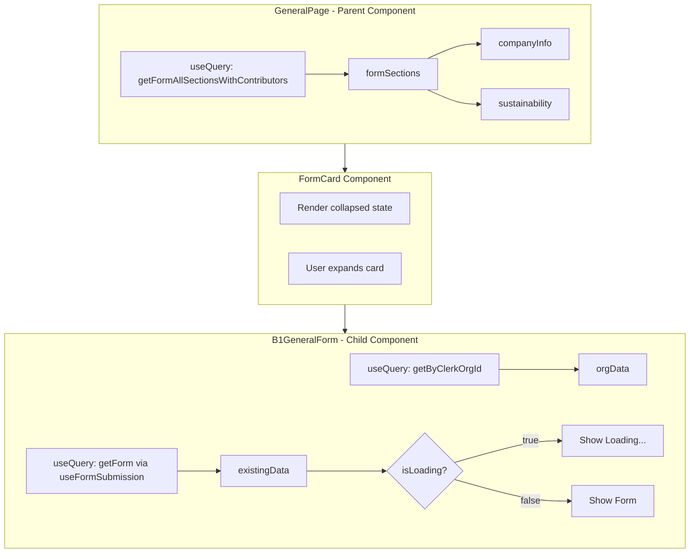

# Form Data Loading Analysis

## Problem Statement

When opening the FormCard component to view the form, a "Loading form data..." message appears briefly even though the data should already be cached. The user observes that the only network activity is loading the `no.svg` flag for the country selector.

## Current Architecture

### Data Flow Diagram



### Key Files Involved

| File                                                                                         | Purpose        | Queries Made                         |
| -------------------------------------------------------------------------------------------- | -------------- | ------------------------------------ |
| [`src/routes/_appLayout/app/general/index.tsx`](src/routes/_appLayout/app/general/index.tsx) | Parent page    | `getFormAllSectionsWithContributors` |
| [`src/components/forms/b1-general-form.tsx`](src/components/forms/b1-general-form.tsx)       | Form component | `getByClerkOrgId`, `getForm`         |
| [`src/hooks/use-form-submission.ts`](src/hooks/use-form-submission.ts)                       | Form hook      | `getForm`                            |
| [`src/hooks/use-org-guard.ts`](src/hooks/use-org-guard.ts)                                   | Org guard      | None - provides `skipQuery`          |

## Root Cause Analysis

### Why isLoading Shows True

The `isLoading` state in [`useFormSubmission.ts:146`](src/hooks/use-form-submission.ts:146) is defined as:

```typescript
const isLoading = existingData === undefined
```

This returns `true` when:

1. **Query is skipped** - When `skipQuery === 'skip'`, Convex returns `undefined`
2. **Query is loading** - Initial fetch hasn't completed yet
3. **No data exists** - The form has never been saved

### The Real Issue: Duplicate Queries

The parent page (`GeneralPage`) and child component (`B1GeneralForm`) make **separate but overlapping queries**:

| Query                                | Location                            | Returns                            |
| ------------------------------------ | ----------------------------------- | ---------------------------------- |
| `getFormAllSectionsWithContributors` | GeneralPage                         | All sections with contributor info |
| `getForm`                            | B1GeneralForm via useFormSubmission | Single section data                |

**Key Insight**: These are **different Convex query functions**. Even though they query the same underlying database table, Convex treats them as separate subscriptions with independent caching.

### Convex Caching Behavior

Convex uses **WebSocket-based real-time subscriptions**, not traditional HTTP caching:

1. **First subscription** - Opens WebSocket connection, fetches data, returns `undefined` until ready
2. **Subsequent subscriptions with same args** - Reuses existing subscription, returns cached data immediately
3. **Different query functions** - Creates new subscription, even if querying same data

### Why Network Tab Shows Only no.svg

The Convex queries use WebSocket connections, not HTTP requests. The data is already in the Convex client cache from the parent's query, but:

1. `getFormAllSectionsWithContributors` returns data in a different shape than `getForm`
2. The child component's `getForm` query needs its own subscription
3. The WebSocket message for `getForm` doesn't appear in the network tab as an HTTP request

## Recommendations

### Option 1: Pass Data from Parent (Recommended)

Pass the already-fetched `companyInfo` from `GeneralPage` to `B1GeneralForm` as props:

```typescript
// In GeneralPage
<B1GeneralForm 
  initialData={companyInfo}
  orgData={orgData}
/>

// In B1GeneralForm - use initialData directly, skip query if provided
```

**Pros**: 
- Eliminates duplicate queries
- Instant render when expanding card
- Simpler data flow

**Cons**:
- Requires refactoring form component
- Parent needs to fetch all required data

### Option 2: Use React Suspense with Error Boundary

Wrap the form in a Suspense boundary and use a pattern that works with Convex:

```typescript
// Create a wrapper component
function B1GeneralFormSuspense() {
  return (
    <Suspense fallback={<FormLoadingSkeleton />}>
      <B1GeneralForm />
    </Suspense>
  )
}
```

**Note**: Convex doesn't have a native `useSuspenseQuery`, but you can create a pattern using `useQuery` and checking for `undefined`.

### Option 3: Optimistic UI with Default Values

Show the form immediately with default values while data loads:

```typescript
// In useFormSubmission.ts
const isLoading = existingData === undefined && !defaultValuesProvided
```

**Pros**:
- Instant feedback
- Works with existing architecture

**Cons**:
- May show stale/default data briefly
- Could confuse users if data differs significantly

### Option 4: Prefetch on Card Hover/Focus

Prefetch the form data when the user hovers over or focuses the card:

```typescript
// In FormCard - prefetch on hover
<CardHeader 
  onMouseEnter={() => prefetchFormQuery()}
  ...
>
```

**Pros**:
- Data likely ready when user expands
- Minimal code changes

**Cons**:
- May prefetch unnecessarily
- Still requires query

## Recommended Implementation Plan

### Phase 1: Quick Fix - Improve Loading State

1. Add a more informative loading skeleton instead of text
2. Consider showing the form with disabled fields while loading

### Phase 2: Architectural Improvement - Pass Data from Parent

1. Refactor `GeneralPage` to fetch all required data
2. Pass `companyInfo` and `orgData` as props to `B1GeneralForm`
3. Modify `useFormSubmission` to accept optional initial data
4. Skip internal queries when initial data is provided

### Phase 3: Consider TanStack Query Integration

The project already uses `@convex-dev/react-query` (see [`src/integrations/convex/provider.tsx`](src/integrations/convex/provider.tsx)). This enables:

- Using TanStack Query's `useQuery` with Convex
- Access to `useSuspenseQuery` for better loading patterns
- More control over caching and stale times

## Confirmed Root Cause

**User confirmed**: The loading state appears briefly every time the card is collapsed/expanded.

### The Problem: Conditional Rendering Unmounts Components

In [`expandable-card-simple.tsx:116`](src/components/ui/expandable-card-simple.tsx:116):

```typescript
{isExpanded && (
  <motion.div>
    {children}
  </motion.div>
)}
```

This pattern **conditionally renders** children based on `isExpanded`. The flow is:

1. Card collapses → `B1GeneralForm` unmounts
2. Convex subscription is cleaned up (component no longer subscribed)
3. Card expands → `B1GeneralForm` mounts fresh
4. New subscription created → `existingData === undefined` initially
5. Loading state shows until WebSocket delivers cached data

### Why Convex Cache Doesn't Help

Convex maintains a client-side cache, but:
- The cache is keyed by query function AND arguments
- When a component unmounts, its subscription is removed
- On remount, a new subscription is created
- Even though data exists in cache, there's a brief moment where `useQuery` returns `undefined` before the cached value is provided

## Recommended Solutions

### Solution A: Keep Component Mounted (CSS-based hiding) - RECOMMENDED

Change the expandable card to keep children mounted but hidden:

```typescript
// Instead of conditional rendering
<motion.div
  initial={false}
  animate={{ 
    height: isExpanded ? 'auto' : 0,
    opacity: isExpanded ? 1 : 0
  }}
  className="overflow-hidden"
>
  <div className="space-y-2">{children}</div>
</motion.div>
```

**Pros**:
- Component stays mounted, subscription maintained
- Instant display when expanding
- Minimal code change

**Cons**:
- Form components stay in memory when collapsed
- Slightly higher memory usage

### Solution B: Pass Data from Parent

Refactor to pass `companyInfo` from `GeneralPage` to `B1GeneralForm`:

```typescript
// In GeneralPage
const companyInfo = formSections?.companyInfo

<B1GeneralForm 
  initialData={companyInfo}
  orgData={orgData}
/>
```

**Pros**:
- Eliminates duplicate queries
- Data available immediately

**Cons**:
- Requires significant refactoring
- Need to handle form state synchronization

### Solution C: Use React Context for Form Data

Create a context that maintains form data independently of component mounting:

```typescript
// FormDataProvider.tsx
const FormDataContext = createContext(null)

export function FormDataProvider({ children }) {
  const formSections = useQuery(api.forms.get.getFormAllSectionsWithContributors, ...)
  
  return (
    <FormDataContext.Provider value={formSections}>
      {children}
    </FormDataContext.Provider>
  )
}
```

**Pros**:
- Data persists across mount/unmount
- Multiple components can share data

**Cons**:
- Additional abstraction layer
- Context update considerations

## Implementation Recommendation

**Start with Solution A** (CSS-based hiding) as it's the simplest fix with minimal code changes. If memory becomes a concern with many forms, consider Solution B or C.

### Implementation Steps for Solution A

1. Modify `expandable-card-simple.tsx` to use CSS opacity/height instead of conditional rendering
2. Remove the `AnimatePresence` wrapper that triggers unmounting
3. Test that form state persists when collapsing/expanding
