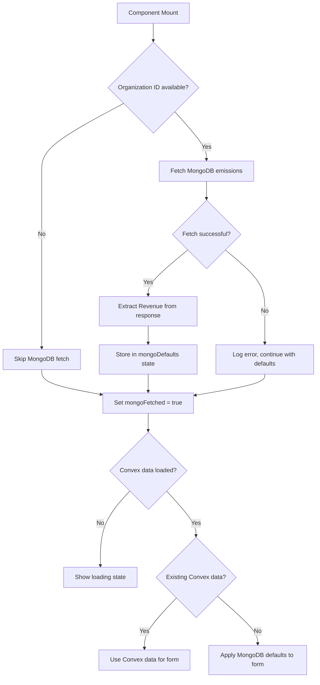

# Plan: Fetch Revenue from MongoDB as Form Default

## Summary

Fetch the `Revenue` field from MongoDB emissions data and use it as the default value for the `revenue` field in `B1GeneralForm`, but only when there is no existing data stored in Convex.

## Current State

### MongoDB Data Structure
The MongoDB `companies` collection contains emissions data with the following structure:
```json
{
  "Emissions": {
    "2024": {
      "Revenue": 8700000,
      "TotalCo2": 339.22,
      "Scope1": 13.6,
      ...
    }
  }
}
```

### Existing Pattern
The [`b3-energy-emissions.tsx`](src/components/forms/b3-energy-emissions.tsx:1) already implements this pattern:
1. Uses `useAction` to call `api.emissions.getEmissionsByOrgId`
2. Fetches MongoDB data on component mount
3. Stores MongoDB defaults in local state
4. Updates form values only when no existing Convex data exists
5. Combines loading states for proper UI feedback

## Implementation Plan

### Step 1: Add Required Imports
Add the following imports to [`b1-general-form.tsx`](src/components/forms/b1-general-form.tsx:1):
- `useAction` from `convex/react`
- `useEffect`, `useState` from `react`
- `api` from `../../../convex/_generated/api`

### Step 2: Add State for MongoDB Defaults
Add state variables to track:
- `mongoDefaults` - object containing fetched MongoDB data
- `isFetchingMongo` - loading state for MongoDB fetch
- `mongoFetched` - flag to indicate fetch completed

### Step 3: Fetch MongoDB Data on Mount
Add a `useEffect` that:
1. Checks if organization ID is available
2. Calls `getEmissions` action with org ID and reporting year
3. Extracts `Revenue` from the response (note: capitalized in MongoDB)
4. Stores in `mongoDefaults` state

### Step 4: Update Form Values When Appropriate
Add a `useEffect` that:
1. Waits for both MongoDB fetch and Convex data load to complete
2. Checks if there is NO existing data in Convex (`!existingData?.data && !existingData?.draftData`)
3. If no existing data, sets the form's `revenue` field to the MongoDB value

### Step 5: Update Loading State
Modify the loading check to include `isFetchingMongo`:
```typescript
if (isLoading || isFetchingMongo) {
  return <div>Loading form data...</div>
}
```

## Code Changes Required

### File: `src/components/forms/b1-general-form.tsx`



## Key Considerations

### Field Name Mapping
- MongoDB uses `Revenue` (capitalized)
- Form uses `revenue` (lowercase)
- Must map between these

### Data Priority
1. **Existing Convex data** (highest priority) - user has already saved the form
2. **MongoDB data** (fallback) - pre-populate from external source
3. **Hardcoded default** (lowest priority) - `0` as final fallback

### Loading States
Must wait for BOTH:
- Convex query to complete (`isLoading`)
- MongoDB action to complete (`isFetchingMongo`)

### Error Handling
- MongoDB fetch failures should not block form rendering
- Log errors but continue with default value of `0`

## Testing Checklist

- [ ] Form loads correctly when organization has MongoDB data
- [ ] Form loads correctly when organization has no MongoDB data
- [ ] Form loads correctly when MongoDB fetch fails
- [ ] Existing Convex data takes priority over MongoDB data
- [ ] MongoDB data is used when no Convex data exists
- [ ] Loading state shows while fetching MongoDB
- [ ] Revenue field displays correct value from MongoDB

## Related Files

- [`src/components/forms/b1-general-form.tsx`](src/components/forms/b1-general-form.tsx:1) - Form to modify
- [`src/components/forms/b3-energy-emissions.tsx`](src/components/forms/b3-energy-emissions.tsx:1) - Reference implementation
- [`convex/emissions.ts`](convex/emissions.ts:1) - Convex action for MongoDB fetch
- [`convex/mongodb/queries.ts`](convex/mongodb/queries.ts:1) - MongoDB query function
