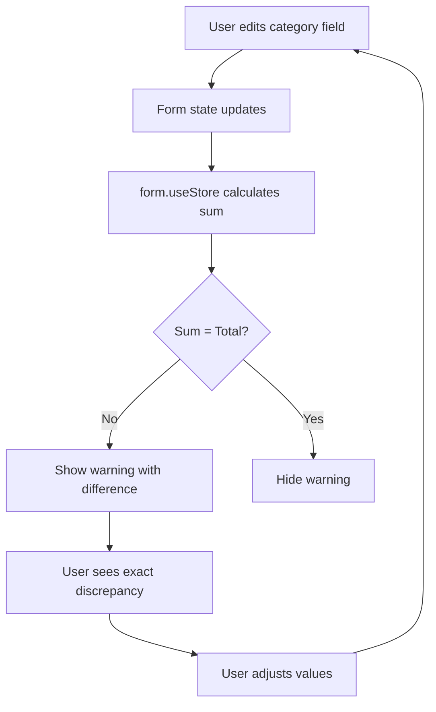

# Scope 3 Category Sum Validation Plan

## Overview

Add real-time validation to the C2 Scope 3 Emissions form that compares the sum of individual Scope 3 category values against the "Total Scope 3 Emissions" field. When there's a mismatch, display a warning message showing the exact difference to help users identify and correct discrepancies.

## Problem Statement

Users can enter a total Scope 3 emissions value and individual category values that don't match. This can lead to:
- Data inconsistencies in reports
- Confusion about which value is correct
- Difficulty identifying where the discrepancy lies

## Solution

Implement real-time validation that:
1. Calculates the sum of all 15 Scope 3 category fields
2. Compares this sum to the "Total Scope 3 Emissions" field
3. Displays a warning when they don't match
4. Shows the exact difference to help users correct the issue

## UX Design

### Warning Display

```
┌─────────────────────────────────────────────────────────────┐
│ ⚠️ Warning: Categories sum to 800.00 tCO₂e but total is    │
│    1000.00 tCO₂e. Difference: 200.00 tCO₂e                 │
└─────────────────────────────────────────────────────────────┘
```

**Placement**: Below the "Scope 3 Categories" heading, above the category tabs

**Behavior**:
- Appears immediately when sum ≠ total
- Disappears when sum = total
- Updates in real-time as user types
- Non-blocking (warning, not error)

## Technical Design

### Data Flow



### Validation Logic

```typescript
// Calculate sum of all 15 categories
const categorySum = SCOPE_3_CATEGORIES.reduce((sum, cat) => {
  const value = values[`category${cat.number}`] || 0
  return sum + value
}, 0)

// Compare with tolerance for floating point
const total = values.totalScope3Emissions || 0
const difference = Math.abs(categorySum - total)
const hasMismatch = difference > 0.01 // 0.01 tCO₂e tolerance
```

### Scope 3 Categories (15 total)

**Upstream (Categories 1-8)**:
1. Purchased Goods and Services
2. Capital Goods
3. Fuel and Energy Related Activities
4. Upstream Transportation and Distribution
5. Waste Generated in Operations
6. Business Travel
7. Employee Commuting
8. Upstream Leased Assets

**Downstream (Categories 9-15)**:
9. Downstream Transportation and Distribution
10. Processing of Sold Products
11. Use of Sold Products
12. End-of-Life Treatment of Sold Products
13. Downstream Leased Assets
14. Franchises
15. Investments

## Implementation Steps

### Phase 1: TDD - Write Tests (RED)

**File**: `src/components/forms/__tests__/c2-scope3-emissions-form.test.tsx`

**Test Cases**:
1. ✅ Shows warning when category sum < total
2. ✅ Shows warning when category sum > total
3. ✅ Hides warning when category sum = total
4. ✅ Shows correct difference value
5. ✅ Updates warning in real-time as user types
6. ✅ Handles empty/undefined values (treats as 0)
7. ✅ Handles floating point precision (0.01 tolerance)

### Phase 2: Implement Validation (GREEN)

**File**: `src/components/forms/c2-scope3-emissions-form.tsx`

**Changes**:
1. Add `form.useStore()` hook to calculate category sum
2. Calculate difference and mismatch flag
3. Add Alert component below "Scope 3 Categories" heading
4. Conditionally render Alert based on `hasMismatch`
5. Display formatted values with 2 decimal places

### Phase 3: Update Alert Component (if needed)

**File**: `src/components/ui/alert.tsx`

**Changes**:
- Add `warning` variant if not already present
- Yellow color scheme for warning state
- Support for AlertTriangle icon

### Phase 4: Refactor (REFACTOR)

**Potential Improvements**:
- Extract validation logic to separate function
- Add unit tests for calculation logic
- Consider adding "Auto-calculate Total" button
- Add i18n translations for warning message

## File Structure

```
src/
├── components/
│   ├── forms/
│   │   ├── c2-scope3-emissions-form.tsx          # UPDATE
│   │   └── __tests__/
│   │       └── c2-scope3-emissions-form.test.tsx # UPDATE
│   └── ui/
│       └── alert.tsx                              # UPDATE (if needed)
└── lib/
    └── forms/
        └── schemas/
            └── c2-scope3-emissions-schema.ts      # Reference only
```

## Testing Strategy

### Unit Tests

```typescript
describe('C2Scope3EmissionsForm - Category Sum Validation', () => {
  it('shows warning when sum < total', async () => {
    // Set total = 1000, categories sum = 800
    // Expect: Warning with difference 200
  })

  it('shows warning when sum > total', async () => {
    // Set total = 500, categories sum = 800
    // Expect: Warning with difference 300
  })

  it('hides warning when sum = total', async () => {
    // Set total = 800, categories sum = 800
    // Expect: No warning
  })

  it('handles floating point precision', async () => {
    // Set total = 100.00, categories sum = 100.005
    // Expect: No warning (within 0.01 tolerance)
  })

  it('treats empty fields as zero', async () => {
    // Set total = 100, leave categories empty
    // Expect: Warning with difference 100
  })
})
```

### Manual Testing Checklist

- [ ] Warning appears when sum ≠ total
- [ ] Warning disappears when sum = total
- [ ] Warning updates in real-time as user types
- [ ] Difference value is accurate
- [ ] Warning is non-blocking (can still save/submit)
- [ ] Warning displays correctly on mobile
- [ ] Warning works with all 15 categories
- [ ] Warning handles edge cases (empty, negative, very large numbers)

## Edge Cases

| Case                               | Behavior                     |
| ---------------------------------- | ---------------------------- |
| All categories empty               | Sum = 0, compare with total  |
| Total empty                        | Treat as 0, compare with sum |
| Negative values                    | Include in sum calculation   |
| Very large numbers                 | Format with 2 decimals       |
| Floating point (100.005 vs 100.00) | Allow 0.01 tolerance         |

## Success Criteria

- [ ] Tests pass (TDD approach)
- [ ] Warning displays when sum ≠ total
- [ ] Warning shows exact difference
- [ ] Warning updates in real-time
- [ ] Warning is visually clear (yellow, icon)
- [ ] Warning is non-blocking
- [ ] No performance issues with real-time calculation
- [ ] Works across all browsers

## Future Enhancements

1. **Auto-calculate Total Button**: Add button to automatically set total = sum
2. **Category-level Warnings**: Highlight which categories might be incorrect
3. **Historical Comparison**: Show if discrepancy is larger than previous years
4. **Export Warning**: Include warning in PDF/Excel exports
5. **i18n Support**: Translate warning message to Norwegian

## Questions Resolved

1. **Should this be an error or warning?** → Warning (non-blocking)
2. **Where to display the message?** → Below "Scope 3 Categories" heading
3. **How to handle floating point?** → 0.01 tCO₂e tolerance
4. **Should it update in real-time?** → Yes, using `form.useStore()`
5. **What about empty fields?** → Treat as 0

## References

- Form System: `.agent/skills/form-system/`
- TDD Workflow: `.agent/skills/tdd-workflow/`
- Existing Form: `src/components/forms/c2-scope3-emissions-form.tsx`
- Schema: `src/lib/forms/schemas/c2-scope3-emissions-schema.ts`