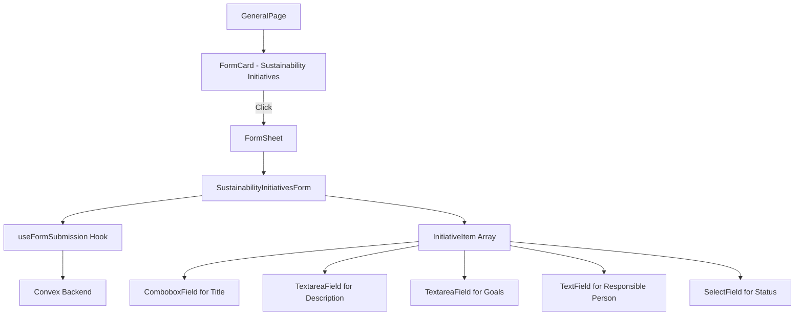
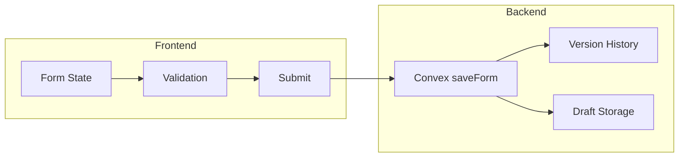

# Sustainability Initiatives Form Implementation Plan

## Overview

This plan outlines the implementation of a Sustainability Initiatives form that captures an array of initiatives. Each initiative has a title (selectable from predefined options or custom), description, goals, responsible person, and status. The form will be rendered in a Sheet that opens when the user clicks on the FormCard.

## UX Design

### Title Field - Combobox with Custom Entry

The title field uses a Combobox pattern that clearly indicates custom entry is possible:

```
┌─────────────────────────────────────────────────────────────┐
│ Initiative Title *                                          │
│ ┌─────────────────────────────────────────────────────────┐ │
│ │ Select from list or type a custom title...        ▼    │ │
│ └─────────────────────────────────────────────────────────┘ │
│ ┌─────────────────────────────────────────────────────────┐ │
│ │ 💡 Tip: You can type a custom title if none match       │ │
│ ├─────────────────────────────────────────────────────────┤ │
│ │ Workforce Development                                    │ │
│ │ Biodiversity                                             │ │
│ │ Climate Change                                           │ │
│ │ Business Ethics                                          │ │
│ │ Circular Economy                                         │ │
│ │ Community Impact                                         │ │
│ │ Marine Resources                                         │ │
│ │ Stakeholder Engagement                                   │ │
│ └─────────────────────────────────────────────────────────┘ │
└─────────────────────────────────────────────────────────────┘
```

**Key UX elements:**
- **Label**: "Initiative Title" (required indicator)
- **Placeholder**: "Select from list or type a custom title..."
- **Helper text**: "💡 Tip: You can type a custom title if none match"
- **When typing**: Show "+ Add '[typed text]'" as an option

### Form Layout

```
┌─────────────────────────────────────────────────────────────┐
│ Sustainability Initiatives                              [X] │
│ Add and manage your organization's sustainability efforts   │
├─────────────────────────────────────────────────────────────┤
│                                                             │
│ ┌─────────────────────────────────────────────────────────┐ │
│ │ Initiative 1                                    [Delete] │ │
│ │ ┌─────────────────────────────────────────────────────┐ │ │
│ │ │ Title: [Combobox]                                   │ │ │
│ │ │ Description: [Textarea]                             │ │ │
│ │ │ Goals: [Textarea]                                   │ │ │
│ │ │ Responsible Person: [Text Field]                    │ │ │
│ │ │ Status: [Select: Not started | In progress | Done]  │ │ │
│ │ └─────────────────────────────────────────────────────┘ │ │
│ └─────────────────────────────────────────────────────────┘ │
│                                                             │
│ [+ Add Initiative]                                          │
│                                                             │
│ [Save Draft] [Submit]                                       │
└─────────────────────────────────────────────────────────────┘
```

### Empty State

When no initiatives are added, the form shows an empty state with the option to add:

```
┌─────────────────────────────────────────────────────────────┐
│ Sustainability Initiatives                              [X] │
│ Add and manage your organization's sustainability efforts   │
├─────────────────────────────────────────────────────────────┤
│                                                             │
│ ┌─────────────────────────────────────────────────────────┐ │
│ │ 📋 No initiatives added yet                            │ │
│ │                                                         │ │
│ │ It's okay if you don't have any sustainability         │ │
│ │ initiatives to report. You can submit this form empty  │ │
│ │ or add initiatives below.                              │ │
│ └─────────────────────────────────────────────────────────┘ │
│                                                             │
│ [+ Add Initiative]                                          │
│                                                             │
│ [Save Draft] [Submit]                                       │
└─────────────────────────────────────────────────────────────┘
```

**Note**: The form can be submitted with an empty initiatives array. This is a valid use case where a company may not have any sustainability initiatives to report.

## Architecture

### Component Flow



### Data Flow



## Implementation Tasks

### 1. Create Zod Schema

**File**: `src/lib/forms/schemas/sustainability-initiatives-schema.ts`

```typescript
import { z } from 'zod'

// Predefined initiative titles
export const PREDEFINED_TITLES = [
  'Workforce Development',
  'Biodiversity',
  'Climate Change',
  'Business Ethics',
  'Circular Economy',
  'Community Impact',
  'Marine Resources',
  'Stakeholder Engagement',
] as const

export const initiativeStatusSchema = z.enum([
  'not_started',
  'in_progress',
  'completed',
])

export const initiativeSchema = z.object({
  id: z.string(),
  title: z.string().min(1, 'Title is required'),
  description: z.string().min(1, 'Description is required'),
  goals: z.string().min(1, 'Goals are required'),
  responsiblePerson: z.string().min(1, 'Responsible person is required'),
  status: initiativeStatusSchema,
})

export const sustainabilityInitiativesSchema = z.object({
  reportingYear: z.string().regex(/^\d{4}$/, 'Year must be 4 digits'),
  // Allow empty array - company may not have any initiatives to report
  initiatives: z.array(initiativeSchema),
})

export type InitiativeStatus = z.infer<typeof initiativeStatusSchema>
export type Initiative = z.infer<typeof initiativeSchema>
export type SustainabilityInitiativesFormValues = z.infer<typeof sustainabilityInitiativesSchema>
```

### 2. Create ComboboxField Component

**File**: `src/components/form-fields/ComboboxField.tsx`

A reusable combobox component that:
- Shows predefined options
- Allows custom text entry
- Displays helper text about custom entry
- Shows "+ Add '[typed text]'" when typing

Uses Shadcn's Command component (cmdk-based) for the dropdown.

### 3. Create FormSheet Component

**File**: `src/components/form-fields/FormSheet.tsx`

A reusable sheet wrapper for forms that:
- Opens from FormCard click
- Contains the form
- Has proper sizing for forms
- Handles close/submit actions

### 4. Create SustainabilityInitiativesForm Component

**File**: `src/components/forms/sustainability-initiatives-form.tsx`

Following the pattern from `b1-general-form.tsx`:
- Uses `useFormSubmission` hook
- Uses `form.AppField` for field rendering
- Implements array field pattern for initiatives
- Add/Remove initiative buttons
- FormButtons for save/submit

### 5. Update Convex Schema

**File**: `convex/schema.ts`

Add validator for sustainability initiatives data:

```typescript
const sustainabilityInitiativesDataValidator = v.object({
  reportingYear: v.string(),
  initiatives: v.array(
    v.object({
      id: v.string(),
      title: v.string(),
      description: v.string(),
      goals: v.string(),
      responsiblePerson: v.string(),
      status: v.string(),
    })
  ),
})
```

### 6. Update General Page

**File**: `src/routes/_appLayout/app/general/index.tsx`

- Add state for sheet open/close
- Replace HelpSheet with FormSheet
- Pass form component to FormSheet

### 7. Add i18n Translations

**Files**: `messages/en.json`, `messages/no.json`

Add translations for:
- Form labels
- Status options
- Button text
- Helper text
- Error messages

## File Structure

```
src/
├── components/
│   ├── form-fields/
│   │   ├── ComboboxField.tsx      # NEW
│   │   └── index.ts               # Update exports
│   ├── forms/
│   │   ├── b1-general-form.tsx
│   │   └── b2-sustainability-initiatives-form.tsx  # NEW
│   └── ui/
│       └── form-sheet.tsx         # NEW (or in form-fields)
├── lib/
│   └── forms/
│       └── schemas/
│           ├── b1-general-schema.ts
│           └── b2-sustainability-initiatives-schema.ts  # NEW
└── routes/
    └── _appLayout/
        └── app/
            └── general/
                └── index.tsx      # Update to add the form component

convex/
└── schema.ts                      # Update with new validator

messages/
├── en.json                        # Update
└── no.json                        # Update
```

## Technical Considerations

### Combobox Implementation

The Combobox will use Shadcn's Command component pattern:

```typescript
import { Command, CommandEmpty, CommandGroup, CommandInput, CommandItem, CommandList } from '@/components/ui/command'
import { Popover, PopoverContent, PopoverTrigger } from '@/components/ui/popover'
```

Key features:
- Filter predefined options as user types
- Show "Add custom" option when input doesn't match any predefined
- Clear visual distinction between predefined and custom options

### Array Field Pattern

Following the established pattern from `b1-general-form.tsx`:

```typescript
<form.AppField name="initiatives">
  {(field) => (
    <div className="space-y-4">
      {field.state.value?.map((item, i) => (
        <div key={item.id}>
          {/* Individual initiative fields */}
          <Button onClick={() => field.removeValue(i)}>Remove</Button>
        </div>
      ))}
      <Button onClick={() => field.pushValue({ id: crypto.randomUUID(), ... })}>
        Add Initiative
      </Button>
    </div>
  )}
</form.AppField>
```

### Form Submission

Uses the existing `useFormSubmission` hook with:
- `table: 'formGeneral'`
- `section: 'sustainabilityInitiatives'`
- Proper schema validation

## Testing Strategy

Following TDD approach from `.agent/skills/tdd-workflow`:

1. **RED Phase**: Write failing tests for:
   - Form renders correctly
   - Can add/remove initiatives
   - Validation works
   - Combobox allows custom entry

2. **GREEN Phase**: Implement features to pass tests

3. **REFACTOR Phase**: Clean up and optimize

## Questions Resolved

1. **Title Field UX**: Combobox with clear custom entry indication ✓
2. **Form Container**: Sheet that opens on FormCard click ✓
3. **Array Handling**: Follow existing subsidiaries pattern ✓

## Next Steps

1. Switch to Code mode to implement
2. Start with Zod schema
3. Create ComboboxField component
4. Create form component
5. Integrate with page
6. Add tests
